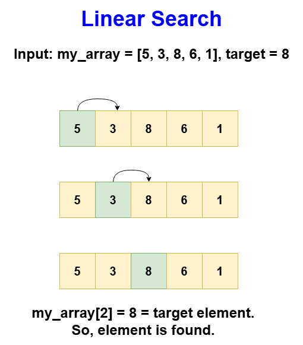
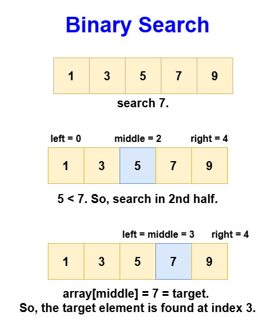

# Introduction to Searching Algorithms

Searching is a fundamental concept in computer science where the task is to find whether a particular value exists within a given dataset and, if so, determine its location. This operation forms the backbone of numerous everyday applications, from looking up a contact in your phone to searching for a product on an online store. Efficient searching algorithms improve the speed and performance of these tasks, making them almost instantaneous even with large datasets.

The effectiveness of a search operation can vary dramatically based on the data structure used and the algorithm implemented. For instance, retrieving a book from a well-organized library is quicker than finding a quote in a disorganized pile of papers.

## Introduction to Searching Algorithms

Searching algorithms are methods used to retrieve information stored within data structures. These can range from simple arrays to more complex data structures like trees and hash tables. The efficiency of a searching algorithm is crucial as it directly impacts the performance of data retrieval tasks.

There are mainly 2 algorithms used for the search:

- Linear search
- Binary search

Let's look at both one by one.

## Linear Search

Linear search is one of the most basic searching algorithms. It scans each element in the array sequentially to find a match with the target value. This method is universally applicable as it does not impose any prerequisites on the array's order or structure.

Linear search is particularly useful when dealing with small or unsorted arrays or lists where the overhead of preparing the data (like sorting required for binary search) would outweigh the benefits of a faster search algorithm.

### Step-by-step algorithm

1. **Start at the beginning**: Initiate the search from the first position in the array.
2. **Iteration Process**
   - **Check for match**: If the element at the current position matches the target, proceed to the final step.
   - **Continue searching**: If there is no match, move to the next position in the array.
3. **Final Step**
   - **Successful find**: If a match is found, return the index of the target element.
   - **Unsuccessful search**: If the end of the array is reached without finding the target, return -1 indicating the target is not in the array.

### Image


### Code

```python
class Solution:
    def linearSearch(self, array, target):
        # Loop through all elements in the array
        for position in range(len(array)):
            # Check if the current element is equal to the target
            if array[position] == target:
                # Return the index of the found element
                return position
        # Return -1 if the target is not found
        return -1
```

### Complexity Analysis

- **Time Complexity**: O(n), because it checks each element in the dataset once.
- **Space Complexity**: O(1), as it uses a constant amount of space regardless of input size.

### Pros

- Simple and easy to implement.
- Does not require the data to be sorted.
- Effective for small datasets.

### Cons

- Inefficient for large datasets, as performance degrades linearly with size.
- Requires more time to find elements as the dataset size increases, or to conclude an element is not present.

## Binary Search Algorithm

Binary search is a highly efficient searching algorithm used for finding the position of an element in a sorted array. Unlike linear search, which scans each element in the array sequentially, binary search divides the search interval in half repeatedly, making the search process significantly faster, especially for large datasets. This method requires the array to be sorted before the search begins because the core mechanism of the algorithm relies on the ability to discard half of the elements in each step based on a single comparison.

The essence of binary search is its decision-based approach to narrowing down the possible location of the sought element. If the middle element of the current interval is not the target, the algorithm uses the order of the array to eliminate half of the remaining elements from consideration. If the target element is greater than the middle element, the search continues in the upper half of the array; otherwise, it continues in the lower half. This process continues until the target element is found or the search interval is exhausted.

### Step-by-Step Algorithm

1. **Initialize pointers**: Set left pointer to 0 and right pointer to the last index of the array.
2. **Middle element calculation**: While the left pointer is less than or equal to the right pointer, calculate the middle index as (left + right) / 2.
3. **Comparison**:
   - **Check match**: If the middle element is equal to the target, return the middle index.
   - **Adjust pointers**:
     - If the middle element is less than the target, set left to middle + 1.
     - If the middle element is greater than the target, set right to middle - 1.
4. **Conclusion**:
   - If the search completes without finding the target (when left exceeds right), return -1.

### Image


### Code

```python
class Solution:
    def binarySearch(self, array, target):
        left = 0
        right = len(array) - 1

        while left <= right:
            middle = left + (right - left) // 2

            if array[middle] == target:
                return middle  # Target found, return its index
```

### Complexity Analysis

- **Time Complexity**: O(log n) — With each comparison, binary search eliminates half of the remaining elements from consideration, thus the time complexity is logarithmic.
- **Space Complexity**: O(1) — Binary search is performed in place, and thus it requires a constant amount of extra space.

### Pros

- Efficient for large datasets: The logarithmic time complexity makes it particularly efficient for searching large arrays.
- Minimal comparisons needed: Reduces the number of comparisons dramatically compared to linear search.
- Predictable: Due to its methodical elimination process, the maximum number of steps can be calculated beforehand.

### Cons

- Requires sorted array: The array must be sorted to apply binary search, which can be costly if the data is not already sorted.
- Not efficient for small datasets: The overhead of preparing the data (sorting) might not be worth the gains from a faster search.
- Poor worst-case performance: In the worst case, the time to sort the array and then perform a binary search might not be better than a simple linear search, especially for smaller or unsorted datasets.

## Real-World Applications of Binary Search

Binary search has a variety of applications across different fields. Here are some common examples:

- **Searching in databases**: Quickly locating records by primary keys, especially in database indices which are often sorted.
- **Computer graphics**: Fast retrieval of color values from palette arrays to speed up rendering.
- **Machine learning**: Efficiently searching through sorted feature lists in decision tree algorithms.
- **Numerical analysis**: Used in algorithms that require finding roots of functions, checking conditions within a range.
- **File systems**: Searching for files within a directory sorted by names.
- **Word processing**: Checking spellings by searching through a dictionary which is typically sorted.
- **Game development**: Searching sorted arrays of scores or rankings to display high scores or leaderboards.
- **Financial markets**: Binary search is used to look for specific price points within large datasets of sorted prices.

Now, let's start solving the problems of searching techniques.