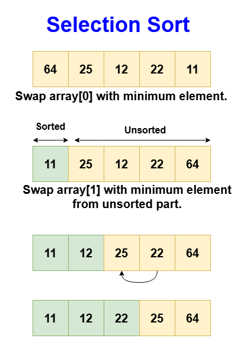
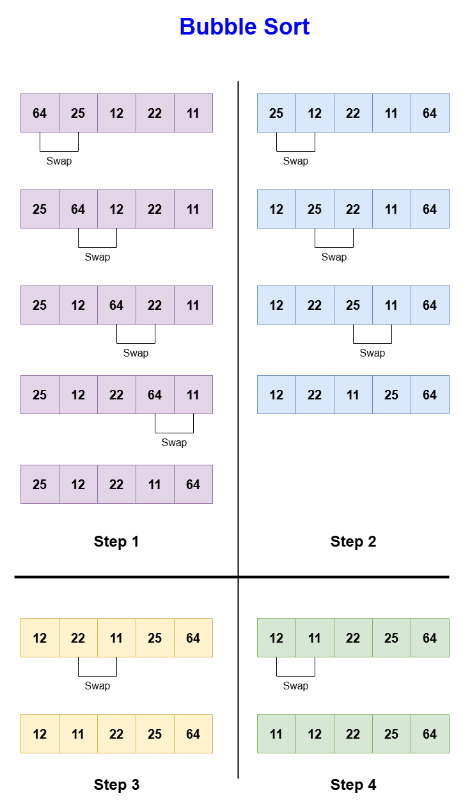
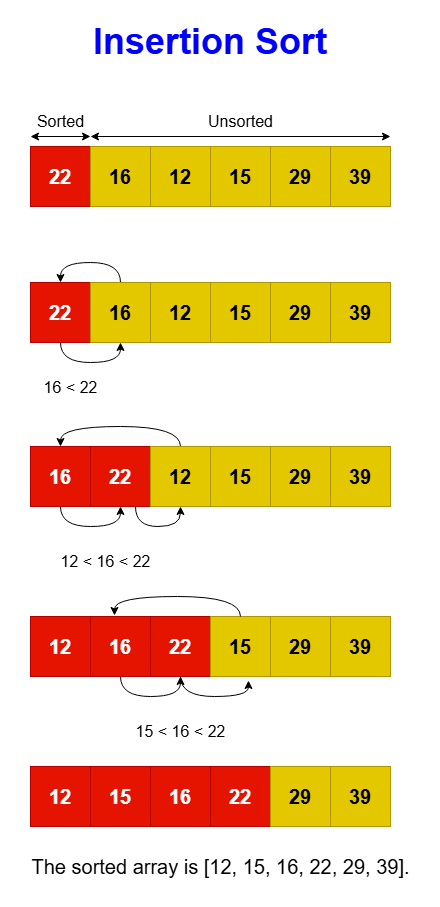
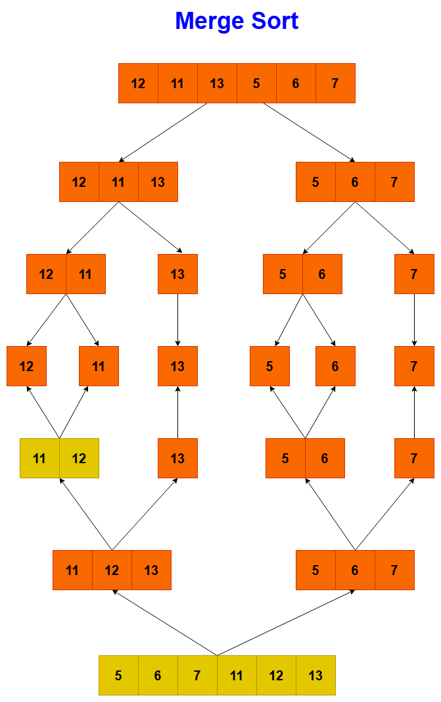
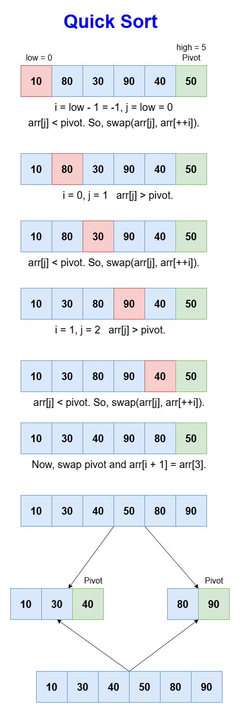

# Introduction to Sorting Algorithms

Sorting is a fundamental operation in computer science, used to organize data in a specified order, be it ascending or descending. This process enhances the efficiency and effectiveness of other algorithms that require sorted data, such as binary search, and also helps in data organization making it easier to visualize and interpret.

Sorting algorithms vary widely in their mechanisms, each with different performance characteristics tailored to particular applications or data structures.

## Terminologies in Sorting

* **Stability**: A sorting algorithm is stable if it preserves the relative order of equivalent elements from the original list.

* **In-place Sorting**: An in-place sorting algorithm rearranges the elements within the array, using only a small, constant amount of additional storage space.

* **Comparison Sort**: A type of sort that determines the sorted order based on comparisons between the input elements.

* **Non-comparison Sort**: Sorting techniques that do not rely on element comparison and typically work with integer keys by grouping and counting elements.

Now, let's look at each sorting algorithm one-by-one.

## 1. Selection Sort

Selection sort is a simple comparison-based sorting algorithm. The fundamental idea is to repeatedly find the smallest (or largest, depending on sorting order) element from the unsorted segment of the list and move it to the end of the sorted segment. This process is repeated for each of the elements until the entire array is sorted. The method divides the input list into two parts: a sorted sublist of items which is built up from left to right at the front (left) of the list, and a sublist of the remaining unsorted items that occupy the rest of the list.

### Step-by-Step Algorithm

* **Initialize**:
  * Start with the first element of the array, treating it as the beginning of the unsorted section.

* **Outer Loop (Sorting boundary)**:
  * Iterate from the start of the array to the second last element.

* **Inner Loop (Find minimum)**:
  * Begin from the current position of the outer loop +1.
  * Compare each element with the current minimum.
  * If a smaller element is found, update the minimum element's index.

* **Swap**:
  * After the inner loop, swap the minimum element found with the first element of the unsorted section.

* **Move boundary**:
  * Increment the starting index of the unsorted section.

Repeat the process until the entire array is sorted.



### Code

``` Python
class Solution:
    # Method to perform selection sort
    def selectionSort(self, arr):
        for i in range(len(arr)):
            # Assume the current index has the minimum value
            min_index = i
            # Find the index of the minimum element in the unsorted portion of the array
            for j in range(i + 1, len(arr)):
                if arr[j] < arr[min_index]:
                    min_index = j
            # Swap the minimum element with the first element of the unsorted portion
            arr[i], arr[min_index] = arr[min_index], arr[i]

solution = Solution()
myArray = [64, 25, 12, 22, 11]
# Call the selection sort method
solution.selectionSort(myArray)
# Print the sorted array
print(myArray)

```

### Complexity Analysis

* **Time Complexity**: O(n²), as there are two nested loops, making it inefficient on large lists.
* **Space Complexity**: O(1), because it's an in-place sort requiring no additional storage beyond swapping elements.

Selection sort is simplistic and intuitive, but its quadratic time complexity makes it less efficient for larger datasets compared to more advanced algorithms like quicksort or mergesort. However, it remains popular for its simplicity and the fact that it makes the minimum possible number of swaps, which can be a deciding factor in certain applications.

## 2. Bubble Sort

Bubble sort is a simple sorting algorithm that repeatedly steps through the list, compares adjacent elements, and swaps them if they are in the wrong order. The pass through the list is repeated until the list is sorted.

### Step-by-Step Algorithm

* **Start at the beginning**:
  * Begin with the first element of the array.

* **Outer Loop (Complete passes)**:
  * Iterate from the start of the array to the end.

* **Inner Loop (Comparison and swap)**:
  * Compare each pair of adjacent elements.
  * If they are in the wrong order, swap them.

* **Optimization Check**:
  * If no swaps are made in a new pass, the list is sorted, and the algorithm stops early.

* **Repeat**:
  * Continue the process until the entire array is sorted.



### Code

``` Python
class Solution:
    # Method to perform Bubble Sort
    def bubbleSort(self, arr):
        swapped = False
        # Traverse through all array elements
        for i in range(len(arr) - 1):
            swapped = False
            # Last i elements are already in place, so inner loop runs for remaining elements
            for j in range(len(arr) - 1 - i):
                # Swap if the current element is greater than the next
                if arr[j] > arr[j + 1]:
                    arr[j], arr[j + 1] = arr[j + 1], arr[j]
                    swapped = True
            # If no two elements were swapped by inner loop, then break
            if not swapped:
                break

solution = Solution()
myArray = [34, 25, 12, 22, 11]
solution.bubbleSort(myArray)
# Print the sorted array
print(myArray)

```

### Complexity Analysis

* **Time Complexity**: O(n²) in the average and worst case, but O(n) in the best case if the array is already sorted and the optimization is used.
* **Space Complexity**: O(1), as it is an in-place sorting algorithm.

## 3. Insertion Sort

Insertion sort works similarly to the way you might sort playing cards in your hands. It assumes that the first element is already sorted, then it goes through the remaining elements one by one, placing each in its proper position relative to those already sorted. The algorithm selects an element, compares it to the elements in the sorted section, and inserts it in the correct position by shifting all larger elements to the right. This process is repeated for each element until the entire array is organized. This method is intuitive and mimics a common human approach to sorting.

### Step-by-Step Algorithm

* **Start with the second element**:
  * Consider the first element sorted by default and start with the second element.

* **Outer Loop (To place the element)**:
  * For each element in the array from the second to the last.

* **Inner Loop (Find the correct position)**:
  * Compare the current element with the elements in the sorted section.
  * Shift all larger elements in the sorted section to the right to make space.

* **Insertion**:
  * Insert the current element into the correct position within the sorted section.

* **Repeat**:
  * Continue until the whole array is sorted.



### Code

```Python
class Solution:
    def insertionSort(self, arr):
        for i in range(1, len(arr)):
            key = arr[i]
            j = i - 1

            # Move elements of arr[0..i-1], that are greater than key,
            # to one position ahead of their current position
            while j >= 0 and arr[j] > key:
                arr[j + 1] = arr[j]
                j -= 1
            arr[j + 1] = key

solution = Solution()
myArray = [22, 16, 12, 15, 29, 39]
solution.insertionSort(myArray)
print(myArray)

```

### Complexity Analysis

* **Time Complexity**: O(n²) in the average and worst case, but O(n) in the best case if the array is nearly sorted.
* **Space Complexity**: O(1), as it performs the sorting in place.

## 4. Merge Sort

Merge sort is an efficient, stable sorting algorithm that employs a divide-and-conquer approach to order elements. By dividing the array into halves, sorting each half, and then merging them back together, it ensures that the entire array is sorted. This method is particularly effective for large data sets where efficiency is crucial.

### Step-by-Step Algorithm

1. **MergeSort(arr, left, right)**:
   * If left < right:
     * Find the middle point: m = (left + right) / 2.
     * Recursively sort the first half: MergeSort(arr, left, m).
     * Recursively sort the second half: MergeSort(arr, m + 1, right).
     * Merge the two sorted halves using Merge(arr, left, m, right).

2. **Merge(arr, left, m, right)**:
   * Determine the sizes of two subarrays to be merged: sizeLeft = m - left + 1, sizeRight = right - m.
   * Create temporary arrays L[] (for the left subarray) and R[] (for the right subarray).
   * Copy data to L[] from arr[left...m] and R[] from arr[m+1...right].
   * Initialize three pointers: i = 0 (for traversing L[]), j = 0 (for traversing R[]), and k = left (for the merged array).
   * Merge arrays L[] and R[] back into arr[left...right]:
     * Compare each element of L[] with R[] and copy the smaller element into arr[k].
     * Increment i or j based on which element was copied, and increment k.
   * Copy any remaining elements in L[] and R[] to arr[], if there are any.

### Key Points

* **Divide**: The array is divided into two halves using the MergeSort function recursively.
* **Conquer**: Each half is sorted recursively using the same MergeSort function.
* **Combine**: The sorted halves are merged into a single sorted array using the Merge function.



### Code

```Python
class Solution:
    def merge(self, arr, l, m, r):
        """
        Merges two subarrays of arr[].
        First subarray is arr[l..m]
        Second subarray is arr[m+1..r]
        """
        # Calculate the sizes of two subarrays to be merged
        n1 = m - l + 1
        n2 = r - m

        # Create temporary arrays
        L = arr[l:l + n1]
        R = arr[m + 1:m + 1 + n2]

        # Merge the temporary arrays back into arr[l..r]
        i = j = 0
        k = l
        while i < n1 and j < n2:
            if L[i] <= R[j]:
                arr[k] = L[i]
                i += 1
            else:
                arr[k] = R[j]
                j += 1
            k += 1

        # Copy the remaining elements of L[], if any
        while i < n1:
            arr[k] = L[i]
            i += 1
            k += 1

        # Copy the remaining elements of R[], if any
        while j < n2:
            arr[k] = R[j]
            j += 1
            k += 1

    def sort(self, arr, l, r):
        """
        Main function that sorts arr[l..r] using merge()
        """
        if l < r:
            # Find the middle point to divide the array into two halves
            m = (l + r) // 2

            # Recursively sort the first and second halves
            self.sort(arr, l, m)
            self.sort(arr, m + 1, r)

            # Merge the sorted halves
            self.merge(arr, l, m, r)

    @staticmethod
    def print_array(arr):
        """
        Utility function to print an array of size n
        """
        print(*arr)

# Driver method to test the Merge Sort algorithm
if __name__ == "__main__":
    arr = [12, 11, 13, 5, 6, 7]

    print("Given Array")
    Solution.print_array(arr)

    ob = Solution()
    ob.sort(arr, 0, len(arr) - 1)

    print("\nSorted array")
    Solution.print_array(arr)
```

### Complexity Analysis

* **Time Complexity**: O(n log n) consistently in all cases.
* **Space Complexity**: O(n) due to the temporary arrays used during the merge process.

Merge sort is particularly effective when sorting data that cannot fit entirely in memory (external sorting), and when stability (preserving the order of equal elements) is important, such as sorting records based on multiple fields.

## 5. Quick Sort

Quick sort is a highly efficient sorting algorithm that also uses the divide-and-conquer approach. It partitions the array into two smaller arrays based on a pivot element such that elements less than the pivot are on one side, and elements greater than the pivot are on the other. These sub-arrays are then recursively sorted.

The efficiency of quick sort comes from its ability to sort the array in-place, and its performance can be nearly two or three times faster than mergesort or heapsort under the right conditions.

### Step-by-Step Algorithm

1. **QuickSort(arr, low, high)**:
   * If the sub-array has more than one element (low < high):
     * Partitioning: Perform the partition using Partition(arr, low, high) and get the pivot position pi.
     * Recursively sort sub-arrays: Apply quicksort to the elements before the pivot (QuickSort(arr, low, pi - 1)) and the elements after the pivot (QuickSort(arr, pi + 1, high)).

2. **Partition(arr, low, high)**:
   * Pivot Selection: Choose the last element as the pivot, pivot = arr[high].
   * Initialization: Set i = low - 1 to indicate the right position of the pivot found so far.
   * Iteration over sub-array:
     * For each element j from low to high-1, compare arr[j] with pivot.
     * If arr[j] < pivot, increment i and swap arr[i] and arr[j].
   * Final placement of the pivot: After the loop, swap arr[i + 1] with arr[high] to place the pivot at its correct sorted position.
   * Return i + 1, the index of the pivot.



### Code

```Python
class Solution:
    # Function to perform the partition
    def partition(self, arr, low, high):
        pivot = arr[high]
        i = low - 1  # Index of smaller element

        for j in range(low, high):
            # If current element is smaller than or equal to pivot
            if arr[j] <= pivot:
                i += 1

                # Swap arr[i] and arr[j]
                arr[i], arr[j] = arr[j], arr[i]

        # Swap arr[i+1] and arr[high] (or pivot)
        arr[i + 1], arr[high] = arr[high], arr[i + 1]

        return i + 1

    # The main function that implements QuickSort
    def quickSort(self, arr, low, high):
        if low < high:
            # pi is partitioning index, arr[pi] is now at right place
            pi = self.partition(arr, low, high)

            # Recursively sort elements before partition and after partition
            self.quickSort(arr, low, pi - 1)
            self.quickSort(arr, pi + 1, high)

solution = Solution()
myArray = [10, 80, 30, 90, 40, 50, 70]
solution.quickSort(myArray, 0, len(myArray) - 1)
print("Sorted array:", myArray)

```
### Complexity Analysis

* **Time Complexity**: O(n²) in the worst case when the smallest or largest element is always picked as the pivot, but typically O(n log n) on average.
* **Space Complexity**: O(log n) due to recursion stack in the best and average case, but O(n) in the worst case.

Quick sort is best used when average performance is important. It performs well on large arrays and with in-memory sorting. Quick sort is also particularly efficient when the data is already partially sorted. However, due to its worst-case scenario, hybrid algorithms like Introsort are sometimes preferred for critical applications that require guaranteed performance levels.

## Real-Time Applications of Sorting Algorithms

Sorting algorithms are fundamental to numerous everyday applications and complex systems. Understanding these applications highlights the importance of choosing the appropriate sorting technique based on the specific needs and constraints of the project. Here are several real-time applications of sorting algorithms:

1. **E-commerce Platforms**
   * Sorting products by price, rating, or relevance to enhance user experience and facilitate easier decision-making. Efficient sorting helps customers quickly find what they are looking for, improving overall satisfaction and sales.

2. **Search Engines**
   * Sorting websites, news articles, or images based on relevance, date, or popularity when displaying search results. This sorting ensures that the most pertinent and useful content is accessible to users first.

3. **Database Management Systems**
   * Sorting is crucial in databases for operations like retrieving and organizing large sets of data, enabling faster query responses through optimized indexing.

4. **Data Analytics**
   * Sorting data for statistical analysis, which can include organizing large datasets for trend analysis, predictive modeling, and operational research.

5. **Operating Systems**
   * Used in task scheduling algorithms where processes are sorted according to priority to efficiently utilize CPU time and manage tasks effectively.

6. **File Systems**
   * Sorting files and directories in a system alphabetically or by size, type, creation date, or last modified date to aid users in locating files quickly.

7. **Social Media Platforms**
   * Sorting posts, comments, or news feeds based on timeliness, relevance, or popularity to ensure a personalized and engaging user experience.

8. **Networking**
   * Sorting routes or data packets by priority to optimize network traffic and reduce latency in communication protocols.

9. **Financial Applications**
   * Sorting transactions, stocks, or financial statements to assist in rapid and accurate data analysis, crucial for decision-making in finance and trading.

10. **Supply Chain Management**
    * Sorting orders, inventory, or delivery routes to optimize logistics and distribution strategies, enhancing efficiency and reducing costs.

These applications demonstrate the pervasive role of sorting in software development and system design, impacting performance, usability, and efficiency across various industries and technologies. Each application may require a different sorting algorithm based on the specific characteristics of the data and the performance requirements of the system.


# Advanced Sorting Techniques

Now, let's explore advanced sorting techniques that go beyond simple comparison-based sorting methods like bubble, merge, and quick sort. Advanced sorting algorithms often handle specific types of data or optimize sorting under unique constraints. They are typically non-comparison sorts that can achieve lower time complexities under certain conditions.

In this lesson, we will cover three significant advanced sorting algorithms:

* **Counting Sort**: An integer sorting algorithm that operates with key assumptions about the range of the input data.
* **Radix Sort**: A non-comparative sorting algorithm that sorts integers digit by digit starting from the least significant digit to the most.
* **Bucket Sort**: Also known as bin sort, it distributes elements into various 'buckets' which are then sorted using another sort, typically insertion sort.

Each of these sorting algorithms will be introduced with their context of use, general working mechanism, a detailed step-by-step guide, sample code implementation, and a complexity analysis.

## Counting Sort

Counting sort calculates the number of occurrences of each distinct element in the array to sort the array. It then uses arithmetic to determine the positions of each element in the output sequence. This sort is efficient when the range of input data is not significantly greater than the number of objects to be sorted.

### Step-by-Step Algorithm

1. **Determine Range**:
   * Identify the Maximum Value: Find the largest value in the input array to determine the range of possible values.
   * Create Count Array: Establish an array, count, with a size of max + 1 (to account for zero indexing) initialized to zero.

2. **Count Occurrences**:
   * Traverse Input Array: For each element x in the input array, increment count[x].
   * Purpose: This step tallies the number of times each value appears in the input array.

3. **Accumulate Counts**:
   * Modify Count Array: Transform each index in the count array to be the sum of the previous indices.
   * Key Operation: count[i] += count[i - 1].
   * Outcome: After this step, count[i] tells the number of elements less than or equal to i.

4. **Build the Output Array**:
   * Initialize Output Array: Create an array output that will store the sorted elements.
   * Place Elements Correctly: Iterate through the input array from the last element to the first (to maintain stability):
     * Place the element in the correct position in the output array: output[count[arr[i]] - 1] = arr[i].
     * Decrement the count in the count array: count[arr[i]]--.
     * Highlight: This placement ensures elements are sorted and that the sort is stable (maintains the relative order of duplicate values).

5. **Copy to Original Array**:
   * Final Step: Copy the sorted elements from the output array back to the original input array.

### Code

```Python
class Solution:
    def countingSort(self, arr):
        maximum = max(arr)
        count = [0] * (maximum + 1)
        output = [0] * len(arr)

        # Count each element
        for num in arr:
            count[num] += 1

        # Accumulate count
        for i in range(1, len(count)):
            count[i] += count[i - 1]

        # Build the output array
        for num in arr:
            output[count[num] - 1] = num
            count[num] -= 1

        # Copy the sorted elements back to original array
        for i in range(len(arr)):
            arr[i] = output[i]

solution = Solution()
arr = [4, 2, 2, 8, 3, 3, 1]
solution.countingSort(arr)
print("Sorted array:", arr)
```

### Complexity Analysis

* **Time Complexity**: O(n + k), where n is the number of elements and k is the range of the input.
* **Space Complexity**: O(n + k), due to the additional space used by the count array.

## Radix Sort

Radix sort is a non-comparative sorting algorithm that sorts numbers digit by digit starting from the least significant digit to the most significant digit. Radix sort uses counting sort as an intermediate sorting method to sort digits. Because it processes individual digits, it can handle large numbers efficiently, provided the digits are uniformly distributed.

### Step-by-Step Algorithm

1. **Find the Maximum Number**:
   * Determine the maximum number in the array to know the number of digits in the longest number.

2. **Sort by Each Digit**:
   * For each digit position, starting from the least significant digit:
     * Apply a stable sort (counting sort) to sort all the numbers according to the digit at the current position.

3. **Counting Sort for Digits**:
   * Instead of sorting by full value, the counting sort is applied to individual digits represented in each position.
   * Use a count array of size 10 (for decimal system) to keep track of the number of occurrences of each digit.

4. **Repeat for All Digit Positions**:
   * Incrementally move to the next significant digit and repeat the sorting process.
   * Continue until the most significant digit has been sorted.

### Code

```Python
class Solution:
    # A utility function to get the maximum value in the array
    def getMax(self, arr):
        max_val = arr[0]
        for i in range(1, len(arr)):
            if arr[i] > max_val:
                max_val = arr[i]
        return max_val

    # Function to perform counting sort on the array according to the digit represented by exp (10^i)
    def countSort(self, arr, exp):
        output = [0] * len(arr)  # output array
        count = [0] * 10
        for i in range(len(arr)):
            count[(arr[i] // exp) % 10] += 1

        for i in range(1, 10):
            count[i] += count[i - 1]

        i = len(arr) - 1
        while i >= 0:
            output[count[(arr[i] // exp) % 10] - 1] = arr[i]
            count[(arr[i] // exp) % 10] -= 1
            i -= 1

        for i in range(len(arr)):
            arr[i] = output[i]

    # The main function to sort arr[] of size n using Radix Sort
    def radixSort(self, arr):
        m = self.getMax(arr)
        exp = 1
        while m // exp > 0:
            self.countSort(arr, exp)
            exp *= 10

solution = Solution()
myArray = [170, 45, 75, 90, 802, 24, 2, 66]
solution.radixSort(myArray)
print("Sorted array:", myArray)
```

### Complexity Analysis

* **Time Complexity**: O(d * (n + b)), where d is the number of digits in the largest number, n is the number of elements in the array, and b is the base of the numbering system used. For the decimal system, b is 10.
* **Space Complexity**: O(n + b), due to the temporary output array and the count arrays used for each digit.

Radix sort is particularly useful when sorting large numbers or strings of characters that can be treated as numbers. It avoids the comparisons typical of other sorting algorithms, making it uniquely fast for specific types of data. However, its efficiency depends heavily on the digit size (d) and the base (b), which determine its appropriateness for a given application.

## Bucket Sort

Bucket sort, also known as bin sort, is an efficient sorting algorithm that distributes elements of an array into a number of buckets. Each bucket is then sorted individually, either using a different sorting algorithm or by recursively applying the bucket sort. This method is useful when the input is uniformly distributed over a range.

### Step-by-Step Algorithm

1. **Create Buckets**:
   * Determine the number of buckets, k, typically equal to the square root of the number of elements in the array.
   * Create an array of buckets where each bucket is a list that will hold elements of the array.

2. **Distribute Elements**:
   * For each element in the array, find the appropriate bucket based on its value. This can be calculated using a function like index = floor(value * k / (maxValue + 1)).
   * Insert the element into its corresponding bucket.

3. **Sort Each Bucket**:
   * Sort the elements in each bucket. This can be done using a simple sorting algorithm like insertion sort for efficiency because each bucket is expected to be small.

4. **Concatenate Buckets**:
   * Once all buckets are sorted, concatenate them back into the original array in order. This effectively compiles the sorted elements into a single sorted array.

### Code

```Python
class Solution:
    def bucketSort(self, arr):
        n = len(arr)
        buckets = [[] for _ in range(n)]

        # Create empty buckets
        for i in range(n):
            buckets[i] = []

        # Add elements into the buckets
        for elem in arr:
            bucketIndex = int(n * elem)  # Assuming the elements are from 0 to 1
            buckets[bucketIndex].append(elem)

        # Sort each bucket
        for i in range(n):
            buckets[i].sort()

        # Concatenate all buckets into arr
        index = 0
        for bucket in buckets:
            for elem in bucket:
                arr[index] = elem
                index += 1

solution = Solution()
myArray = [0.897, 0.565, 0.656, 0.1234, 0.665, 0.3434]
solution.bucketSort(myArray)
print("Sorted array: ")
for elem in myArray:
    print(elem, end=" ")

```

### Complexity Analysis

* **Time Complexity**: The average case is O(n + n * log(n/k)), where k is the number of buckets. If k approaches n, the time complexity nears O(n).
* **Space Complexity**: O(n + k), due to the space needed for the buckets and the elements they contain.

Bucket sort is especially effective when the input is uniformly distributed across a range. It excels at sorting floating-point numbers and can be significantly faster than comparative sorting algorithms like quicksort and mergesort in the right contexts. For example, it's commonly used in scenarios like graphics where precision and performance are crucial, and data sets are often distributed uniformly.

Now, let's start solving the problems of sorting techniques.