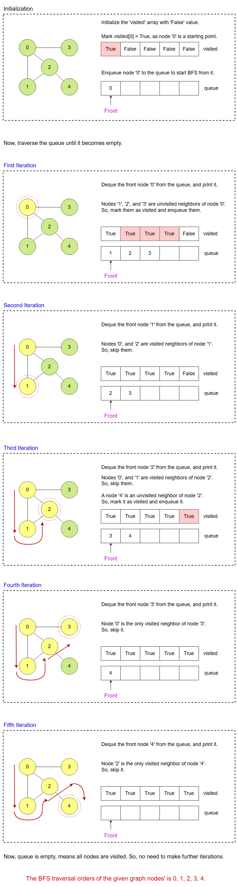

# Graph Traversal - Breadth First Search (BFS)

Breadth-First Search (BFS) is a graph traversal algorithm that explores a graph's vertices (nodes) level by level. It starts from a selected source node and moves outward to visit all the nodes at the same distance from the source before moving on to nodes at the following distance level.

BFS is particularly useful for finding the shortest path in unweighted graphs and for systematically exploring graphs.

---

## Step-by-Step Algorithm for BFS

### Graph Initialization:

- Create a graph with V vertices.  
- Represent the graph using an adjacency list, where each vertex has a list of its adjacent vertices.

### Mark All Vertices as Unvisited:

- Initialize a visited boolean array of size V, with all elements set to false.

### Initialize BFS Traversal:

- Start from the given `startVertex`.  
- Mark `startVertex` as visited by setting `visited[startVertex] = true`.  
- Add `startVertex` to the queue.

### Perform BFS Traversal:

- While the queue is not empty:  
  - Dequeue a vertex (`currentVertex`) from the front of the queue.  
  - Process the `currentVertex` (e.g., print its value).  
  - For each neighbor of `currentVertex` (from its adjacency list):  
    - If the neighbor is unvisited:  
      - Mark it as visited.  
      - Enqueue the neighbor into the queue.

### End Condition:

- The traversal ends when the queue becomes empty, meaning all reachable vertices from the `startVertex` have been visited.

---

## Algorithm Walkthrough

Let's see how the Breadth First Search algorithm works with an example.

### Input:

- Graph:  
- Vertices: 5 (0, 1, 2, 3, 4)  
- Edges: (0, 1), (0, 2), (0, 3), (1, 2), (2, 4)  
- Starting Vertex: 0



## Execution Steps

### Initialization:

- `visited = [false, false, false, false, false]`  
- `queue = []`

### Start BFS Traversal:

- Mark 0 as visited: `visited = [true, false, false, false, false]`.  
- Enqueue 0: `queue = [0]`.

### First Iteration:

- Dequeue 0: `queue = []`.  
- Process 0: Print 0.  
- Explore neighbors of 0:  
  - 1 is unvisited: Mark as visited (`visited = [true, true, false, false, false]`) and enqueue: `queue = [1]`.  
  - 2 is unvisited: Mark as visited (`visited = [true, true, true, false, false]`) and enqueue: `queue = [1, 2]`.  
  - 3 is unvisited: Mark as visited (`visited = [true, true, true, true, false]`) and enqueue: `queue = [1, 2, 3]`.

### Second Iteration:

- Dequeue 1: `queue = [2, 3]`.  
- Process 1: Print 1.  
- Explore neighbors of 1:  
  - 0 is already visited: Skip.  
  - 2 is already visited: Skip.

### Third Iteration:

- Dequeue 2: `queue = [3]`.  
- Process 2: Print 2.  
- Explore neighbors of 2:  
  - 0 is already visited: Skip.  
  - 1 is already visited: Skip.  
  - 4 is unvisited: Mark as visited (`visited = [true, true, true, true, true]`) and enqueue: `queue = [3, 4]`.

### Fourth Iteration:

- Dequeue 3: `queue = [4]`.  
- Process 3: Print 3.  
- Explore neighbors of 3:  
  - 0 is already visited: Skip.

### Fifth Iteration:

- Dequeue 4: `queue = []`.  
- Process 4: Print 4.  
- Explore neighbors of 4:  
  - 2 is already visited: Skip.

### End:

- The queue is empty, so the BFS traversal is complete.

---

## Output:

**Breadth-First Traversal starting from vertex 0:**  
`0 1 2 3 4`

---

## Implementation of Breadth First Search

Below is the implementation of Breadth-First Search (BFS) in different programming languages:

```go
package main

import (
    "container/list"
    "fmt"
)

type Graph struct {
    V       int          // Number of vertices
    adjList [][]int      // Adjacency list to represent the graph
}

func NewGraph(vertices int) *Graph {
    g := &Graph{
        V:       vertices,
        adjList: make([][]int, vertices),
    }

    for i := 0; i < vertices; i++ {
        g.adjList[i] = make([]int, 0)
    }

    return g
}

func (g *Graph) addEdge(u, v int) {
    g.adjList[u] = append(g.adjList[u], v)
    g.adjList[v] = append(g.adjList[v], u) // For undirected graph
}

func (g *Graph) BFS(startVertex int) {
    visited := make([]bool, g.V) // To keep track of visited vertices
    q := list.New()

    visited[startVertex] = true
    q.PushBack(startVertex)

    for q.Len() > 0 {
        currentVertex := q.Remove(q.Front()).(int)
        fmt.Print(currentVertex, " ")

        // Explore adjacent vertices
        for _, neighbor := range g.adjList[currentVertex] {
            if !visited[neighbor] {
                visited[neighbor] = true
                q.PushBack(neighbor)
            }
        }
    }
}

func main() {
    graph := NewGraph(5) // Create a graph with 6 vertices

    graph.addEdge(0, 1)
    graph.addEdge(0, 2)
    graph.addEdge(0, 3)
    graph.addEdge(1, 2)
    graph.addEdge(2, 4)

    fmt.Println("Breadth-First Traversal starting from vertex 0:")
    graph.BFS(0)
}
```
# Complexity Analysis

## Time Complexity

### Initialization:

- The visited array is initialized to track whether a vertex has been visited. This operation is \(O(V)\), where \(V\) is the number of vertices.

### Queue Operations:

- Each vertex is enqueued once when it is first discovered and dequeued once during processing. These operations together are \(O(V)\) over the course of the BFS traversal.

### Exploration of Adjacent Vertices:

- The adjacency list for each vertex is iterated over to explore its neighbors.  
- Each edge is visited exactly once when traversing its endpoints, contributing \(O(E)\), where \(E\) is the number of edges.

### Total Time Complexity:

- The traversal involves visiting all vertices and all edges: \(O(V + E)\).

---

## Space Complexity

### Visited Array:

- The visited boolean array stores one entry per vertex to track whether it has been visited.  
- Space Requirement: \(O(V)\).

### Queue:

- In the worst case, the queue can hold all vertices in a connected component, requiring \(O(V)\) space.

### Total Space Complexity:

- Overall Space Requirement: \(O(V)\) (from visited array and queue).

---

# Final Words

This makes BFS efficient for graph traversal, particularly when combined with the adjacency list representation. BFS is generally efficient for searching and traversal when the graph is not too dense. For sparse graphs, where \(E\) is much smaller than \(V^2\), the time complexity becomes almost linear, making BFS a reasonable choice for many practical applications.

BFS guarantees it visits nodes according to their distance from the source node. It is an efficient algorithm to find the shortest path in unweighted graphs. Additionally, BFS can find connected components, detect cycles, and solve graph-related problems. However, it may consume more memory than DFS, especially in graphs with a significant or infinite branching factor.
