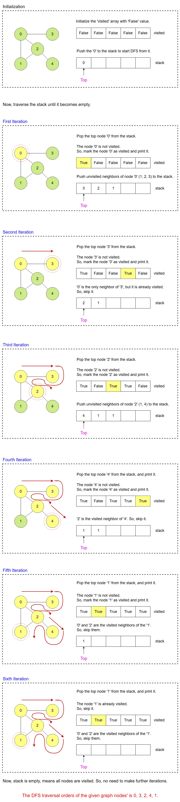

# Graph Traversal - Depth First Search(DFS)

Graphs are made up of nodes (vertices) connected by edges. Traversing a graph means visiting all its nodes in a structured way. This helps solve problems like finding paths, detecting cycles, and searching for specific values.

Two widely used traversal techniques are:

- Depth-First Search (DFS): Explores as far as possible along each branch before backtracking.
- Breadth-First Search (BFS): Explores all neighbors of a node before moving deeper.

This lesson focuses on the Depth-First Search (DFS) approach.

---

## Depth First Search(DFS) Using a Stack Data Structure

Depth-First Search (DFS) is a graph traversal algorithm that explores all the nodes in a graph by systematically visiting as far as possible along each branch before backtracking. It operates on both directed and undirected graphs and can be implemented using recursion or an explicit stack data structure.

DFS starts from a selected source node (or a starting point) and explores as deeply as possible along each branch before backtracking. The algorithm visits nodes in a depth ward motion until it reaches a leaf node with no unexplored neighbors. At that point, it backtracks and explores other unexplored branches.

### Step-by-Step Algorithm

**Initialize the Data Structures:**

- Create a visited array to track whether a node has been visited.
- Initialize an empty stack and push the starting node onto it.

**Traversal Loop:**

- While the stack is not empty:
  - Pop the top node from the stack and mark it as visited.
  - Process the node (e.g., print it).
  - Traverse through all neighbours of the node and push unvisited neighbours onto the stack. This step ensures that we explore the graph as deeply as possible.

**End Condition:**

- The traversal ends when the stack becomes empty, indicating all reachable nodes have been visited.

---

### Step-by-step Algorithm Walkthrough

Let's illustrate Depth-First Search (DFS) on a simple graph with its step-by-step traversal process.



---

## Code Implementation of Depth First Search Using a Stack

In this example implementation, we assume that the graph is represented as an adjacency list.

```go
package main

import (
	"fmt"
)

type Graph struct {
	vertices       int           // Number of vertices
	adjacencyList  [][]int       // Adjacency list
}

// Constructor
func NewGraph(vertices int) *Graph {
	g := &Graph{
		vertices:      vertices,
		adjacencyList: make([][]int, vertices),
	}
	return g
}

// Method to add an edge to the graph
func (g *Graph) addEdge(source, destination int) {
	g.adjacencyList[source] = append(g.adjacencyList[source], destination)
	g.adjacencyList[destination] = append(g.adjacencyList[destination], source) // For an undirected graph
}

// Method to perform DFS using a stack
func (g *Graph) DFS(startVertex int) {
	visited := make([]bool, g.vertices) // Track visited nodes
	stack := []int{}                    // Stack for traversal

	stack = append(stack, startVertex) // Start with the given vertex

	for len(stack) > 0 {
		// Pop a vertex from the stack
		current := stack[len(stack)-1]
		stack = stack[:len(stack)-1]

		if !visited[current] {
			fmt.Print(current, " ") // Process the current node
			visited[current] = true // Mark it as visited
		}

		// Push all unvisited neighbors onto the stack
		for _, neighbor := range g.adjacencyList[current] {
			if !visited[neighbor] {
				stack = append(stack, neighbor)
			}
		}
	}
}

type Solution struct{}

func (Solution) main() {
	g := NewGraph(5)

	g.addEdge(0, 1)
	g.addEdge(0, 2)
	g.addEdge(0, 3)
	g.addEdge(1, 2)
	g.addEdge(2, 4)

	fmt.Print("DFS Traversal starting from vertex 0: ")
	g.DFS(0)
}

func main() {
	Solution{}.main()
}
```
# Complexity analysis

## Time Complexity

### Initialization:

The visited array is initialized, which takes  time, where  is the number of vertices.

### Traversal Loop:

- Each node is pushed onto and popped from the stack exactly once, resulting in  operations for stack management.  
- The inner loop iterates over all neighbors of a vertex. Over the entire execution of the algorithm, all edges are traversed once (each edge is visited when exploring its endpoints).  
- For an undirected graph: Each edge is considered twice (once for each endpoint), but this is still  where  is the number of edges.

### Total Time Complexity:

The traversal loop involves  operations:  
 for visiting each vertex.  
 for traversing all edges.  

Overall Time Complexity: 

---

## Space Complexity

### Visited Array:

A visited boolean array of size  is used to track whether each vertex has been visited.  
Space Requirement: .

### Stack:

In the worst case, the stack may contain all vertices in the graph, particularly in a graph with one long branch or a star graph.  
Space Requirement: .

### Overall Space Complexity:

The total space complexity is: 

---

# Depth First Search(DFS) Using a Recursive Approach

In the recursive approach, the function calls itself to traverse adjacent nodes, mimicking the natural depth-first behavior of the algorithm. This approach leverages the function call stack to manage backtracking, simplifying the implementation.

In recursive DFS, each node is visited once, and its unvisited neighbors are recursively explored. The recursion ends when all reachable nodes have been visited. A visited array is used to ensure nodes are not revisited, preventing infinite loops in cyclic graphs.

## Step-by-Step Algorithm

### Graph Initialization:

Represent the graph using an adjacency list for efficient storage and neighbor lookup.

### Setup for DFS:

Create a visited array of size equal to the number of vertices, initialized to false.

### Start Recursive Traversal:

Call the recursive DFS function, passing the starting vertex and the visited array.

### Recursive Traversal:

- Mark the current vertex as visited and process it (e.g., print its value).  
- Recur for each unvisited neighbor of the current vertex by calling the DFS function for that neighbor.

### Backtracking:

If there are no more unvisited neighbors for the current node, backtrack by returning from the recursive function.

### Termination:

The DFS algorithm terminates when all nodes reachable from the source node have been visited. This means that all connected components of the graph have been explored.

---

## Algorithm Walkthrough

### Input Graph:

- Vertices: 5  
- Edges: (0, 3), (0, 2), (0, 1), (1, 2), (2, 4)  
- Starting Vertex: 0

### Execution Steps:

#### Initialization:

visited = [false, false, false, false, false]

#### First Call from 0:

- Call `DFSRecursive(0, visited)`.  
- Mark 0 as visited: `visited = [true, false, false, false, false]`.  
- Print 0.  
- Recur for neighbors 3, 2, 1.

#### Second Call to 3:

- Call `DFSRecursive(3, visited)`.  
- Mark 3 as visited: `visited = [true, false, false, true, false]`.  
- Print 3.  
- No unvisited neighbors for 3, return to previous call.

#### Back to 0, and visit 2:

- Call `DFSRecursive(2, visited)`.  
- Mark 2 as visited: `visited = [true, false, true, true, false]`.  
- Print 2.  
- Recur for neighbor 1.

#### Visit 1:

- Call `DFSRecursive(1, visited)`.  
- Mark 1 as visited: `visited = [true, true, true, true, false]`.  
- Print 1.  
- No unvisited neighbors for 1, return to previous call.

#### Back to node 2, and visit 4:

- Call `DFSRecursive(4, visited)`.  
- Mark 4 as visited: `visited = [true, true, true, true, true]`.  
- Print 4.  
- No unvisited neighbors for 4, return to previous call.

#### End of Traversal:

All nodes have been visited, and the recursive calls terminate.

### Output:

DFS Traversal: 0 3 2 1 4

```go
package main

import (
	"fmt"
)

type Graph struct {
	vertices      int
	adjacencyList [][]int // Adjacency list
}

// Constructor
func NewGraph(vertices int) *Graph {
	g := &Graph{
		vertices:      vertices,
		adjacencyList: make([][]int, vertices),
	}
	return g
}

// Method to add an edge to the graph
func (g *Graph) addEdge(source, destination int) {
	g.adjacencyList[source] = append(g.adjacencyList[source], destination)
	g.adjacencyList[destination] = append(g.adjacencyList[destination], source) // For an undirected graph
}

// Method to perform DFS using recursion
func (g *Graph) DFS(startVertex int) {
	visited := make([]bool, g.vertices) // Track visited nodes
	fmt.Print("DFS Traversal: ")
	g.DFSRecursive(startVertex, visited) // Start DFS from the given vertex
}

func (g *Graph) DFSRecursive(currentVertex int, visited []bool) {
	visited[currentVertex] = true // Mark the current node as visited
	fmt.Printf("%d ", currentVertex) // Process the current node

	// Recur for all unvisited neighbors
	for _, neighbor := range g.adjacencyList[currentVertex] {
		if !visited[neighbor] {
			g.DFSRecursive(neighbor, visited)
		}
	}
}

type Solution struct{}

func (Solution) main() {
	g := NewGraph(5)

	g.addEdge(0, 3)
	g.addEdge(0, 2)
	g.addEdge(0, 1)
	g.addEdge(1, 2)
	g.addEdge(2, 4)

	fmt.Print("DFS Traversal starting from vertex 0: ")
	g.DFS(0)
}

func main() {
	Solution{}.main()
}
```
# Complexity Analysis for Recursive DFS

## Time Complexity

### Traversal of Nodes (Vertices):

- Each node is visited exactly once during the traversal.  
- Marking a node as visited and processing it are constant-time operations, contributing  for all nodes, where V is the number of vertices.

### Traversal of Edges:

- Each edge is explored exactly twice: once for each endpoint (due to the undirected nature of the graph).  
- Checking the adjacency list for unvisited neighbors takes time proportional to the number of edges.  
- The total time spent on edges is , where E is the number of edges.

### Recursive Calls:

- The recursion explores each node and its neighbors, visiting every edge exactly once.  
- The cost of recursive calls depends on the depth of recursion, which corresponds to the height of the DFS tree.

### Total Time Complexity:

Overall: , as all vertices and edges are visited once.

---

## Space Complexity

### Visited Array:

- The visited[] array requires  space, where each element corresponds to a vertex in the graph.

### Recursive Call Stack:

- The depth of the recursion stack corresponds to the height of the DFS tree:  
  - In the worst case (e.g., a single long chain of nodes), the depth can be equal to V, requiring  stack space.  
  - In a balanced graph, the height of the DFS tree is proportional to .

### Total Space Complexity:

Overall: , dominated by the recursion stack.

---

# Final Words

DFS can be used for various applications, such as finding connected components, detecting cycles in the graph, topological sorting, and solving problems like maze exploration or finding paths between nodes.

It's essential to be cautious about infinite loops when traversing graphs that may have cycles. To avoid this, the algorithm must keep track of visited nodes and avoid revisiting nodes that have already been explored.

Overall, DFS is a powerful graph traversal algorithm that can efficiently explore the entire graph and is widely used in many graph-related problems.
