# 📊 Graphs: A Fundamental Data Structure

A **graph** is a data structure used to represent relationships or connections between objects. A graph consists of two main parts:

- **Vertices (Nodes)**: Represent the individual objects.
- **Edges (Links)**: Represent the connections between those objects.

A graph is often denoted as `G(V, E)` where:

- `V` is the set of vertices.
- `E` is the set of edges connecting pairs of vertices.

---

## 🧠 Example

Consider a graph with five nodes A, B, C, D, and E, and the following connections:

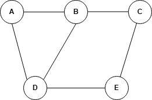

This graph forms a network of connections, where you can traverse from one node to another based on the defined edges.

As the graph grows larger, it can become highly interconnected, forming complex relationships and paths.

---

## 🚀 Why Are Graphs Important?

Graphs are a fundamental and flexible data structure used in many real-world scenarios—especially those involving:

- 📍 Routes and maps
- 👥 User connections in social media
- 🌐 Communication networks
- 📅 Dependencies in task scheduling
- 🔗 Web page links and recommendations

---

## 📚 Common Graph Terminologies

Understanding baseline graph terminology is essential for mastering graph concepts.

### 1. **Node (Vertex)**

A **node** (also known as a **vertex**) is a fundamental building block of a graph.

> Nodes represent entities, and edges represent relationships between them.

Example: In a graph with nodes A, B, C, D, and E — each letter is a node.

### 2. **Adjacent Nodes**

Two nodes are **adjacent** if an edge directly connects them.

> The set of nodes adjacent to a given node is called its **neighborhood**.

Example: In a graph with an edge between A and B, A and B are adjacent.

### 3. **Digraph (Directed Graph)**

A **digraph** is a graph in which edges have a direction (represented by arrows).

- An edge from vertex A → B means you can move from A to B, but not necessarily from B to A.

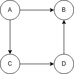

### 4. **Loop**

A **loop** is an edge that connects a vertex to itself.

- In **undirected graphs**, it’s just an edge from a node to itself.

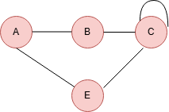

- In **directed graphs**, it's a one-way edge that starts and ends at the same node.

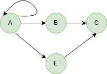

### 5. **Degree of a Node**

The **degree** of a node is the number of edges connected to it.

- In **undirected graphs**:
  - Degree is the count of all connecting edges.
  - A self-loop counts as **2**.

Example:
- Node A with two neighbors → degree 2
- Node C with:
  - 1 edge to B
  - 1 edge to E
  - 1 loop → counts as 2
  - **Total Degree** = 1 + 1 + 2 = 4

  

- In **directed graphs**:
  - **In-degree**: number of incoming edges
  - **Out-degree**: number of outgoing edges
  - In the below graph, the degree of node A is two because two edges are outgoing, and the degree of node C is 1.

  

### 6. **Path**

A **path** is a sequence of vertices where each adjacent pair is connected by an edge.

Example: A → B → C

### 7. **Cycle**

A **cycle** is a path where the first and last nodes are the same.

Example:
- A → B → D → C → A
- This forms a **closed loop** (cycle)

---

> ✅ Graphs are crucial in algorithms, networking, scheduling, and much more. Mastering graph basics is a gateway to solving advanced problems like shortest paths, connectivity, and traversal.

# 📘 Types of Graphs

Graphs can vary based on how their edges behave, whether they carry weights, and how their nodes are connected. Understanding these types helps in choosing the right data structure or algorithm for your problem.

---

## 1. 🔄 Undirected Graph

- Edges have **no direction**.
- If there's an edge between `A` and `B`, you can go **both ways**: A → B and B → A.
- Represents **two-way relationships**.

📌 **Example**: A friendship network — if Alice is friends with Bob, then Bob is also friends with Alice.

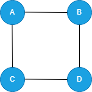

---

## 2. 🔁 Directed Graph (Digraph)

- Edges have a **specific direction**.
- A → B does **not** imply B → A.
- Useful for representing **one-way relationships**.

📌 **Example**: Web page links — one site may link to another, but not necessarily the other way around.

---

## 3. ⚖️ Weighted Graph

- Each edge has a **value (weight)** representing **cost, time, distance**, etc.
- Useful when connections are **not equal**.

📌 **Example**: A road map — edges represent travel time or distance.

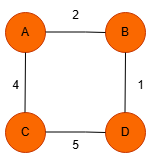

---

## 4. ➖ Unweighted Graph

- All edges are treated **equally**.
- No weights — just pure connectivity.

📌 **Example**: Family trees or org charts where relationships either **exist or don’t**.

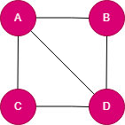

---

## 5. 🔁 Cyclic Graph

- Contains **at least one cycle** (a path that starts and ends at the same node).
- Cycles must involve **three or more nodes** (not just a self-loop).

📌 **Example**: A group of people connected in a way where you can return to the start by following connections.

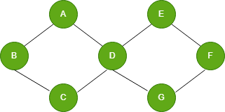

---

## 6. 🔄 Acyclic Graph

- **No cycles** allowed — once you leave a node, you can’t come back.

### Two Variants:
- **Undirected Acyclic Graph**: If it's connected, it's called a **Tree**; multiple trees form a **Forest**.
- **Directed Acyclic Graph (DAG)**: Has directed edges and no cycles. Can be **topologically sorted**.

📌 **Example**: Task scheduling — some tasks must happen before others.

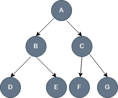

---

## 7. 🔗 Connected Graph

- Every node is **reachable** from every other node.
- Applies to **undirected graphs**.

📌 **Example**: A fully connected computer network.

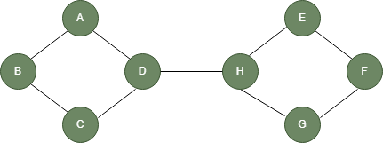

---

## 8. ❌ Disconnected Graph

- **Not all nodes are connected**.
- Made up of **independent components**.

📌 **Example**: Two social groups with no connections between them.

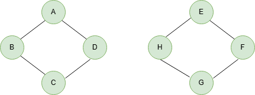

---

## 9. 🔄 Strongly Connected Graph

- Applies to **directed graphs**.
- Every node is reachable from **every other node** — in **both directions**.

📌 **Example**: A one-way street network where you can still reach all streets and return.

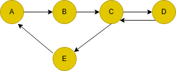
---

## 📊 Summary Comparison Table

| Graph Type           | Directional? | Weighted? | Cycles Allowed | Example                          |
|----------------------|--------------|-----------|----------------|----------------------------------|
| **Undirected**       | ❌           | Optional  | Yes/No         | Friendship network               |
| **Directed**         | ✅           | Optional | Yes/No          | Web links                        |
| **Weighted**         | ✅ / ❌     | ✅       | Yes/No          | Road map                         |
| **Unweighted**       | ✅ / ❌     | ❌         | Yes/No        | Family tree                      |
| **Cyclic**           | ✅ / ❌       | Optional  | ✅           | Social group forming a circle    |
| **Acyclic (Tree/DAG)**| ✅ / ❌       | Optional  | ❌          | Task scheduling, directory tree  |
| **Connected**        | ❌           | Optional  | Yes/No         | Fully linked network             |
| **Disconnected**     | ✅ / ❌       | Optional  | Yes/No       | Disconnected subgraphs           |
| **Strongly Connected**| ✅           | Optional  | Yes/No        | One-way road system              |

---

> ✅ Understanding the **types of graphs** helps in choosing the right algorithms, especially for problems involving **search, traversal, shortest paths, cycles, and connectivity**.

# Graph Representations

Graphs can be represented in multiple ways depending on the use case. The two most common methods are:

- Adjacency Matrix
- Adjacency List

Let’s break down both approaches with examples for undirected and directed graphs.

---

## 1 Adjacency Matrix

An adjacency matrix is a 2D array (or matrix) used to represent the presence or absence of edges between vertices.

- The matrix is of size N × N, where N is the number of vertices.
- Each cell (i, j) indicates whether there’s an edge from vertex i to vertex j.

### Adjacency matrix for Undirected Graph

- If an edge exists between vertex i and j, then both A[i][j] and A[j][i] are set to 1.
- If no edge exists, both entries are 0.
- The matrix is symmetric across the diagonal.

#### Example
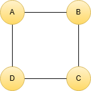
Undirected Graph with 4 Edges (A-B, B-C, C-D, D-A)  
 
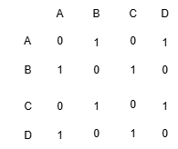
Adjacency Matrix for the Above Graph with 4 Edges (A-B, B-C, C-D, D-A)  
 

---

### Adjacency matrix for directed graphs

In a directed graph with N vertices, the adjacency matrix A will also be an N x N matrix. For a directed edge from vertex i to vertex j, the corresponding entry in the matrix () will have the value of 1, indicating the presence of an edge from i to j. If there is no edge from vertex i to vertex j, the matrix entry will have the value of 0.

#### Example of a directed graph with 4 vertices (A, B, C, D) and 5 directed edges (A->B, A->C, C->D, D->B, D->C):

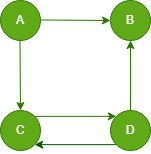
Directed Graph with 5 Edges (A->B, A->C, C->D, D->B, D->C)  
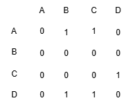

_Image_  
The above figure explains the adjacency matrix of the directed graph in such a way that there is an edge between vertices A-C and A-B so 1 is placed there.

---

## Adjacency List

An adjacency list stores each vertex alongside a list of its neighbors. It is space-efficient for sparse graphs (graphs with fewer edges).

- Each node maps to a list of connected nodes.
- It is commonly implemented using arrays or hash maps with linked lists or dynamic arrays.

### Representing undirected graph using adjacency list

In an undirected graph, the edges between vertices have no direction. If vertex A is connected to vertex B, then vertex B is also connected to vertex A. As a result, the adjacency list for an undirected graph is symmetric. Here is an example of a undirected graph with four vertices (A, B, C, D) and four edges.

 
Here is the adjacency list for the above-undirected graph. From vertex A there is an edge to vertex B and C in the graph. So in the adjacency list, there are two nodes from node A.

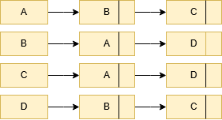 

### Representing directed graphs using adjacency list

In a directed graph, the edges between vertices have a direction. If vertex X is connected to vertex Y, it does not necessarily mean that vertex Y is connected to vertex X. As a result, the adjacency list for a directed graph is not symmetric.

#### Example of a directed graph with 4 vertices (A, B, C, D) and 4 directed edges (A->B, A->C, C->D, D->B):

Here is the adjacency list for the above directed graph. From vertex A there is an edge to vertex B and C in the graph. So in the adjacency list, there are two nodes from node A. From vertex B there is no edge coming out so the adjacency list contains no further node from node B.

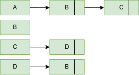