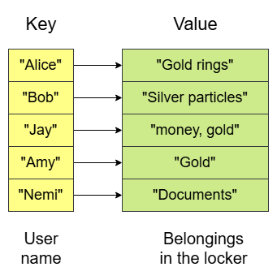
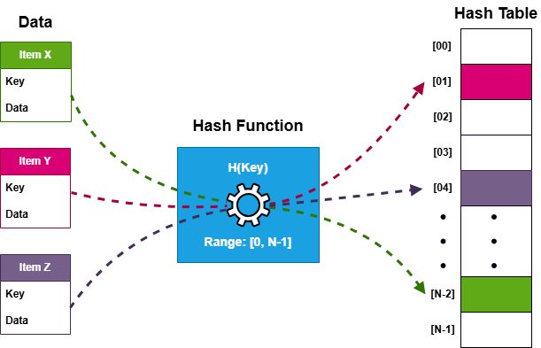
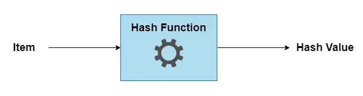
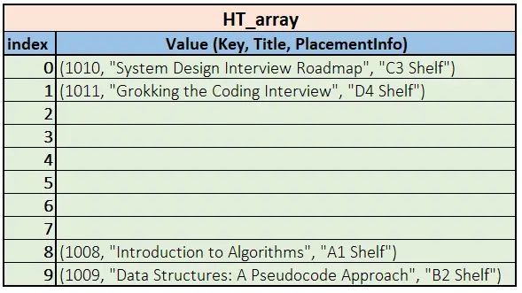
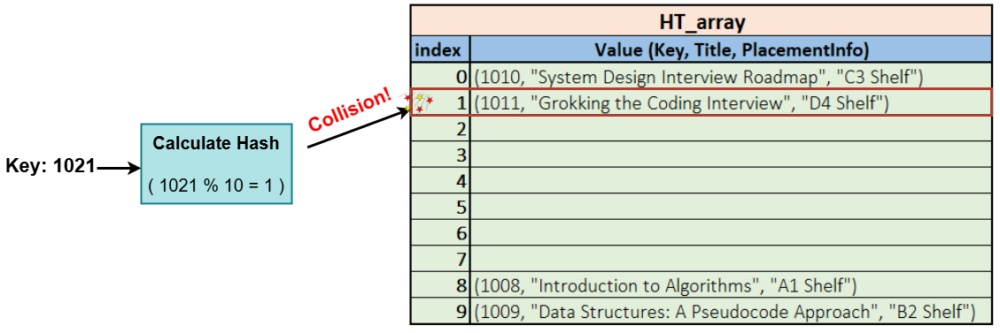

# 📘 Introduction to Hash Tables

A **Hashtable** is a data structure that stores **key-value pairs** and allows **fast lookups, insertions, and deletions**. It's a fundamental tool in programming for efficiently managing and retrieving data.

---

## 🔐 Real-World Analogy

Imagine a locker system where:

- Your **name** is the **key**.
- Your **belongings** are the **values**.
- A **locker number** (computed from your name) determines where you store/retrieve items.

Instead of searching through an entire list, a Hashtable uses a **hash function** to compute an index, allowing **quick access** to the value.

---

## ✨ Key Characteristics of Hashtables

- ✅ **Fast Lookups (Average Time Complexity: O(1))**  
  Unlike arrays or lists where searching takes O(n) time, Hashtables offer nearly constant-time lookups.

- ✅ **Efficient Insertions & Deletions**  
  Elements are placed at computed indices, making updates quick.

- ✅ **Unique Keys**  
  Each key must be unique — adding a duplicate key will overwrite the previous value.

- ✅ **No Guaranteed Order**  
  Hashtables do not preserve the order of insertion like arrays or linked lists.

---

## ⚙️ Operations on a Hashtable

A Hashtable maps keys to specific indices using a **hash function**, which determines where each key-value pair is stored in an underlying array.

### 🔑 Insertion
- The key is passed through a **hash function**, generating an **index**.
- The value is stored at that index.

> _Note: Hash functions will be covered in more detail in the next lesson._

### 🔍 Lookup
- To find a value, the Hashtable computes the index from the key and retrieves the value directly.

### ❌ Deletion
- The key is passed through the hash function to find the index.
- The key-value pair at that index is removed.

---

## 🧠 When to Use a Hashtable?

Use a Hashtable when you need:

- ⚡ **Quick lookups** (e.g., finding user data from an ID)
- ❎ **Duplicate removal** (e.g., tracking unique users)
- 🛠️ **Configuration storage** (e.g., storing key-value settings)
- 🚀 **Fast caching systems** (e.g., database indexing, memory cache)

---

## 📌 Summary

Hash Tables are a powerful, efficient tool for managing key-value data with near-instant access. Mastering them unlocks faster algorithms and cleaner code in a wide range of applications.

# 🧠 Hashing, Collisions, Overflow, and Resizing in Hashtables

---

## 1️⃣ Understanding Hashing in Hashtables

A **Hashtable** stores key-value pairs using a **hash function** that converts a key into a numeric index in an array. This enables quick lookups, insertions, and deletions.

### 🔹 How Hashing Works

1. A key (e.g., `Book ID: 1008`) is passed through a **hash function**.
2. The hash function computes an index based on the key  
   _e.g.,_ `1008 % 10 → 8`.
3. The value (e.g., `"A1 Shelf"`) is stored at that index.
4. To retrieve the value, the key is hashed again, and the value is accessed directly from the computed index.

### ✅ Advantages of Hashing

- **Fast lookups**: O(1) time when no collisions occur
- **Scales well** with large datasets

> 🚨 But what happens when two keys map to the same index?  
> That leads us to **collisions**.

---

## 2️⃣ Collisions in Hashtables

A **collision** occurs when two **different keys produce the same index** after hashing. 

A collision happens when two different keys produce the same index after hashing. Since a Hashtable uses an array-based structure, only one value can be stored at an index—so the system must handle this situation.

### 📚 Collision Example: Library Book Storage

Imagine a library where books are stored on numbered shelves, determined by their ISBN (Book ID) % 10. The Book ID acts as the key, while the Shelf Location represents the value in a Hashtable.

    The library assigns each book a shelf number using a hash function:

    If two books hash to the same shelf, a collision occurs.

    The library must efficiently organize multiple books on the same shelf to avoid data loss.

We insert the following books:

Imagine books are stored on shelves using `Book ID % 10` to compute the shelf (index).

| Book ID | Title                                     | Shelf (Hash: % 10) |
|---------|-------------------------------------------|--------------------|
| 1008    | Introduction to Algorithms                | A1 (Index 8)       |
| 1009    | Data Structures: A Pseudocode Approach    | B2 (Index 9)       |
| 1010    | System Design Interview Roadmap           | C3 (Index 0)       |
| 1011    | Grokking the Coding Interview             | D4 (Index 1)       |
| 1021    | Grokking the Art of Recursion             | E5 (Index 1 ❗️)    |

### ⚠️ Collision Scenario

- `Book 1011` hashes to Shelf 1 → Stored successfully.
- `Book 1021` also hashes to Shelf 1 → **Collision occurs!**

Without a proper **collision-handling mechanism**, Book 1021 would overwrite Book 1011.

### ⏱️ How Time Complexity Increases

- When multiple values exist at the same index, a **linear search** is needed to find the correct key.
- If all keys collide to one shelf, Hashtable degenerates into a list →  
  **Time complexity becomes O(n)** instead of O(1).

> 🚨 **Worst-case scenario**:  
> Hashtable behaves like a **linked list** with O(n) performance.

---

## 3️⃣ Overflow and Resizing

Even with good collision handling, **Hashtables can fill up**. To avoid performance degradation, they support **dynamic resizing** based on the **load factor**.

### 📏 What is Load Factor?

The **load factor** is the ratio:

Load Factor = (Number of Elements) / (Capacity of Hashtable)

- A common threshold is **0.7 (70%)**.
- If exceeded, the Hashtable **resizes** to reduce the number of collisions.

### 🔄 How Resizing Works

1. **Create a larger table** (typically 2× current size).
2. **Rehash all existing keys** using the new table size.
3. **Insert** each key-value pair into its new index.

This keeps the hash table efficient as it grows.

---

## 🧪 In Summary

| Concept     | Description                                                                 |
|-------------|-----------------------------------------------------------------------------|
| Hashing     | Converts keys to indices using a hash function                              |
| Collision   | Happens when two keys hash to the same index                                |
| Overflow    | Occurs when capacity is too small                                           |
| Resizing    | Increases capacity when load factor is high                                 |

---

### ⏭️ What's Next?

We will explore **how to implement Hashtables** in different programming languages like Go, Python, and JavaScript.

