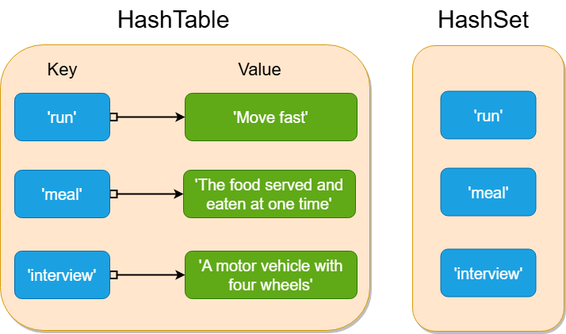

# 🧠 Introduction to HashSets

In simple terms, a **HashSet** is a collection of **unique elements** where duplicates are not allowed.  
Imagine a party guest list where each person’s name appears only once—no duplicates! That’s exactly how a HashSet works in programming.

It ensures that every element in the set is **unique**, making it an efficient choice for **fast lookups, insertions, and deletions**.

---

## 🔑 Core Characteristics of HashSets

- ✅ **Uniqueness**:  
  A HashSet ensures that every element is unique.  
  If you try adding a duplicate, it simply gets ignored.  
  _Think of putting different types of fruits into a basket—no two apples allowed!_

- ✅ **Null Elements**:  
  A HashSet may allow a `null` (or `nil`) element depending on the language.  
  Only **one** such `null` value is allowed.

- ✅ **Unordered Collection**:  
  HashSets do not maintain any specific order.  
  _Imagine reaching into a bag of mixed candies—you never know which one you’ll grab first!_

---

## ⚙️ How Does a HashSet Work Internally?

- 🔹 **Handling Duplicates**:  
  When a duplicate is added, the HashSet ignores it.  
  If the element is already in the set, it keeps the original and discards the duplicate.

- 🔹 **Hashing Function**:  
  HashSets use a hash function to compute an index.  
  _Like sorting library books into shelves based on the first letter of the title._

- 🔹 **Resizing the Set**:  
  If a HashSet becomes too full, it **automatically expands** its capacity.  
  _Think of adding more tables at a party as guests arrive._

---

## 📦 Example: Creating a HashSet in Go

```go
package main

import "fmt"

func main() {
    // Creating a HashSet using a map
    fruits := make(map[string]bool)

    // Adding elements
    fruits["Apple"] = true
    fruits["Banana"] = true
    fruits["Apple"] = true // Duplicate, will be ignored

    // Checking existence
    if fruits["Banana"] {
        fmt.Println("Banana is in the set")
    }

    // Printing elements
    for fruit := range fruits {
        fmt.Println(fruit)
    }
}
```

## 📊 HashTable vs. HashSet



| Feature     | HashTable                    | HashSet                         |
|-------------|------------------------------|----------------------------------|
| **Structure**   | Stores key-value pairs        | Stores only unique values         |
| **Usage**       | Used for mapping relationships | Used for fast existence checks    |
| **Duplicates**  | Keys unique, values can repeat | No duplicates allowed             |
| **Order**       | No guaranteed order           | No guaranteed order               |

---

## 🛠️ Using HashSets in Different Programming Languages

### 🔧 Implementation of HashSet Across Languages

The following table summarizes how `HashSet` is implemented in various programming languages:

| Language     | API / Implementation                        |
|--------------|----------------------------------------------|
| **Java**     | `java.util.HashSet`                          |
| **Python**   | `set`                                        |
| **C++**      | `std::unordered_set`                         |
| **JavaScript** | `Set`                                     |
| **C#**       | `HashSet<T>`                                 |
| **Go**       | No built-in HashSet (use `map[T]bool`)       |

Most languages have a built-in `HashSet` structure.  
In Go, however, you can simulate a HashSet using a `map` with boolean values.

---

## ⏱️ Time Complexity of HashSet

- **Insertion**, **lookup**, and **deletion** operations typically run in **O(1)** time on average,  
  because the hash function computes an index directly.

- In the **worst case**, operations degrade to **O(n)** if multiple elements collide  
  and are stored in a single bucket, requiring a linear search.

- The **best-case scenario** remains **O(1)** when elements are evenly distributed  
  across the hash table.

> ✅ HashSets perform efficiently as long as **collisions are minimized** and the **load factor** is well-maintained.

---

## 🧠 Space Complexity of HashSet

- On average, HashSets require **O(n)** space, where `n` is the number of stored elements.

- If **resizing** occurs due to a high load factor, temporary space usage may increase to **O(m)**,  
  where `m` is the new table size after **rehashing** all elements.

---

## 🚀 When to Use a HashSet?

- ✅ **Fast lookups**: Checking if an element exists is **O(1)** on average.
- ✅ **Removing duplicates**: Perfect for filtering out repeated values.
- ✅ **Unordered collections**: Ideal when order doesn't matter.
- ✅ **Unique storage**: Best for storing distinct items only.

---


