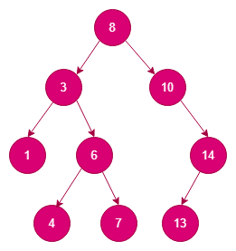
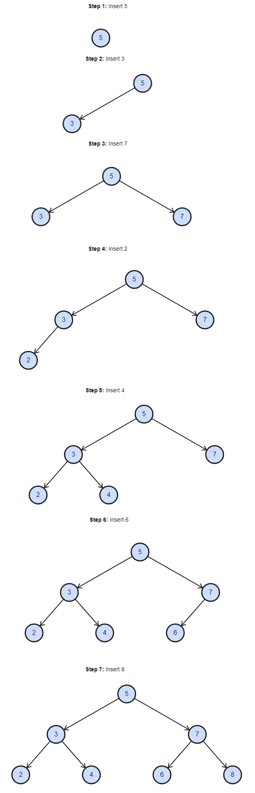
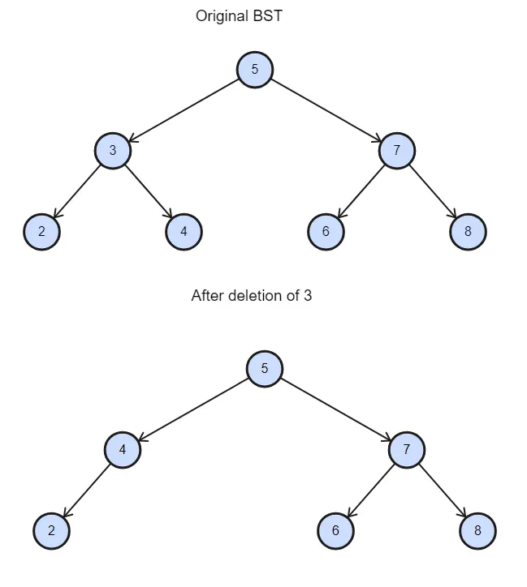
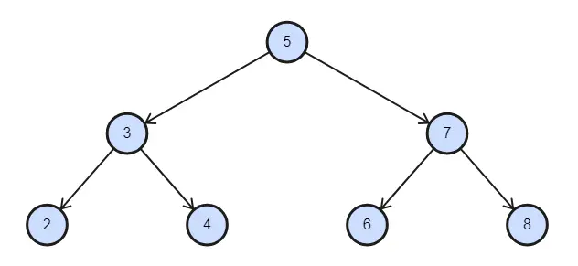
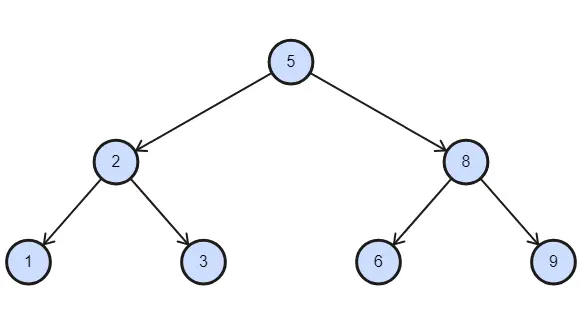
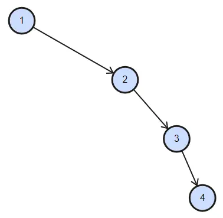
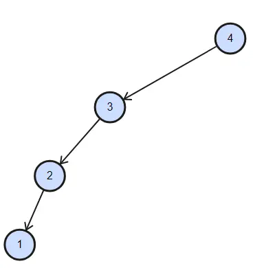

## Binary Search Tree (BST)

Cover what a BST is and how they are used.

### 1. Introduction - What is a Binary Search Tree (BST)
A Binary Search Tree (BST) is a fundamental data structure that organizes elements in a hierarchical manner, allowing for efficient searching, insertion, deletion, and traversal operations. In this section, we will explore the characteristics of a BST, its benefits, applications, ADT operations, time and space complexity, as well as potential issues and BSTs.

#### Definition and Characteristics of BST
A Binary Search Tree is a binary tree in which each node has at most two children, referred to as the left child and the right child. The BST follows a specific property: for any given node, all nodes in its left subtree have values less than or equal to the node's value, and all nodes in its right subtree have values greater than the node's value.

**Example**:  
Consider the following BST:  
  

In this example, the tree satisfies the BST property since, for each node, all nodes in its left subtree have values less than the node's value, and all nodes in its right subtree have values greater than the node's value.

#### Benefits and Applications of BST
- **Efficient Searching**: BSTs provide fast searching capabilities with an average time complexity of O(log n) for balanced trees. This makes them suitable for applications that require quick data retrieval based on a key, such as database indexing and dictionary implementations.
- **Ordered Data Storage**: The inherent order of BSTs makes them suitable for scenarios where data needs to be stored in a sorted manner. For example, BSTs can maintain sorted lists or retrieve elements in a particular order.
- **Binary Search Tree in Databases**: BSTs are used in databases to create indexes that allow for faster data retrieval based on specific fields. Using BSTs for indexing, databases can efficiently handle large datasets and complex queries.
- **Binary Search Tree in File Systems**: File systems often use BSTs to organize and manage directory structures. The hierarchical nature of BSTs aligns well with the hierarchical structure of directories, enabling efficient file retrieval.

---

### BST Abstract Data Type (ADT)
The BST ADT covers various operations to manipulate and manage the tree efficiently. The basic operations typically supported by a BST ADT include the following:

- Insertion  
- Update  
- Deletion  
- Search  
- In-order Traversal  
- Pre-order Traversal  
- Post-order Traversal  

#### Data Model: Node Class
Let's start by discussing our data model. We will use a Node struct to represent a single node of a BST. Here's what our Node struct looks like:

```go
type Node[T any] struct {
    Data  T
    Left  *Node[T]
    Right *Node[T]
}
```
The above class represents a single node of a binary tree. It has the following members:

- `data`: A template member that stores the value of the node.
- `left`: A pointer to the left child node.
- `right`: A pointer to the right child node.

The class has two constructors:

- `Node()`: Default constructor that initializes `left` and `right` pointers to null (0).
- `Node(int v)`: Constructor that takes a value `v` and initializes `info` with it. It also sets `left` and `right` pointers to null.

### ADT Class

Now, let's look at the BST ADT class definition.

```go
package main

// Comparable is an interface for data that can be compared.
type Comparable interface {
	CompareTo(Comparable) int
}

// Node represents a node in the BST.
type Node struct {
	Data  Comparable
	Left  *Node
	Right *Node
}

// BST represents a binary search tree.
type BST struct {
	root *Node
}

// inOrderHelper is a stub for in-order traversal.
func (s *BST) inOrderHelper(p *Node) {
	// TODO: implement in-order traversal
}

// preOrderHelper is a stub for pre-order traversal.
func (s *BST) preOrderHelper(p *Node) {
	// TODO: implement pre-order traversal
}

// postOrderHelper is a stub for post-order traversal.
func (s *BST) postOrderHelper(p *Node) {
	// TODO: implement post-order traversal
}

// findMin is a stub for finding the minimum value node.
func (s *BST) findMin(node *Node) *Node {
	// TODO: implement findMin
	return nil // Placeholder return
}

// deleteNode is a stub for deleting a node.
func (s *BST) deleteNode(root *Node, data Comparable) *Node {
	// TODO: implement deleteNode
	return nil // Placeholder return
}

// NewBST creates a new instance of BST.
func NewBST() *BST {
	return &BST{}
}

// Insert is a stub for inserting a new node.
func (s *BST) Insert(data Comparable) {
	// TODO: implement Insert
}

// deleteMethod is a stub for deleting a node.
func (s *BST) deleteMethod(data Comparable) {
	// TODO: implement deleteMethod
}

// search is a stub for searching a node.
func (s *BST) search(data Comparable) bool {
	// TODO: implement search
	return false // Placeholder return
}

// inOrder is a stub for in-order traversal.
func (s *BST) inOrder() {
	// TODO: implement inOrder
}

// preOrder is a stub for pre-order traversal.
func (s *BST) preOrder() {
	// TODO: implement preOrder
}

// postOrder is a stub for post-order traversal.
func (s *BST) postOrder() {
	// TODO: implement postOrder
}
```
# Binary Search Tree (BST) Implementation

This code above contains the implementation of a Binary Search Tree (BST) class. The BST is designed to support various data types using templates. It provides efficient methods for managing and manipulating binary search trees.

## Features

- **Private Helper Functions:**
  - In-order traversal
  - Pre-order traversal
  - Post-order traversal
  - Finding the minimum node in a subtree
  - Deleting a node
  - Updating a node's value

- **Public Interface:**
  - Insert nodes into the tree
  - Delete nodes
  - Search for nodes
  - Update node values
  - Perform in-order, pre-order, and post-order traversals

This code facilitates operations on BSTs with various data types while maintaining the BST property.

## BST ADT Operations

### Insertion

The insertion operation adds a new element to the BST while maintaining the BST property. The BST property ensures:
- The left subtree contains nodes with values less than or equal to the current node's value.
- The right subtree contains nodes with values greater than the current node's value.

### Insert Method Implementation

```go
func (s *Solution) Insert(value int) {
    newNode := &TreeNode{Value: value}

    if s.Root == nil {
        s.Root = newNode
    } else {
        current := s.Root
        var parent *TreeNode

        for current != nil {
            parent = current
            if value < current.Value {
                current = current.Left
            } else {
                current = current.Right
            }
        }

        if value < parent.Value {
            parent.Left = newNode
        } else {
            parent.Right = newNode
        }
    }
}
```
# Binary Search Tree (BST) - Insert Function

The given code is a template function to insert a new node with a value into a binary search tree (BST) while maintaining the BST property. 

## BST Property

- If the tree is empty, the new node becomes the root.
- Otherwise, the function traverses the tree to find the appropriate position for insertion:
  - Goes **left** if the value is less than the current node.
  - Goes **right** if the value is greater than the current node.

Once the correct position is found, the new node is added as the **left** or **right** child of the parent node. This ensures the BST remains ordered.

## Example

Consider an empty BST. Insert the values `5, 3, 7, 2, 4, 6, and 8` in the following order:

1. **5** becomes the root.
2. **3** is added to the left of `5`.
3. **7** is added to the right of `5`.
4. **2** is added to the left of `3`.
5. **4** is added to the right of `3`.
6. **6** is added to the left of `7`.
7. **8** is added to the right of `7`.

The resulting BST structure will look like this:


# Binary Search Tree (BST) - Deletion

The deletion operation removes a node from the BST while maintaining the BST property. Deletion can be complex as it involves handling different cases based on the node to be deleted.

## Cases in Deletion

1. **Node with no children**: Simply remove the node.
2. **Node with one child**: Replace the node with its child.
3. **Node with two children**: Replace the node with its inorder successor (smallest node in the right subtree) and delete the successor.

The following methods handle the deletion process:

- `findMin`: Finds the minimum value node in a subtree.
- `deleteNode`: Handles the recursive deletion of a node.
- `deleteMethod`: Public method to delete a node by value.

## Implementation

### `findMin` - Helper Function

Finds the minimum node in a given subtree.

```go
// Helper function to find the minimum node in a subtree
func (bst *BST) findMin(node *Node) *Node {
	current := node
	for current.left != nil {
		current = current.left
	}
	return current
}

// Helper function to delete a node
func (bst *BST) deleteNode(root *Node, data int) *Node {
	if root == nil {
		return root
	}

	if data < root.data {
		root.left = bst.deleteNode(root.left, data)
	} else if data > root.data {
		root.right = bst.deleteNode(root.right, data)
	} else {
		// Node with only one child or no child
		if root.left == nil {
			temp := root.right
			root = nil
			return temp
		} else if root.right == nil {
			temp := root.left
			root = nil
			return temp
		}

		// Node with two children: Get the inorder successor (smallest in the right subtree)
		temp := bst.findMin(root.right)
		root.data = temp.data

		// Delete the inorder successor
		root.right = bst.deleteNode(root.right, temp.data)
	}
	return root
}

// Public function to delete a node
func (bst *BST) deleteMethod(data int) {
	bst.root = bst.deleteNode(bst.root, data)
}
```
# Deletion in Binary Search Tree (BST)

The code provides two functions: `findMin` and `deleteNode`, along with a public function `deleteMethod`, that uses the `deleteNode` function to delete a node from the BST.

## Functions

### `findMin` - Helper Function

The `findMin` function is a helper function that finds the minimum node in a given subtree. It starts from the given node and traverses the left children until it reaches the leftmost node, which contains the smallest value in the subtree. It returns the pointer to this minimum node.

### `deleteNode` - Helper Function

The `deleteNode` function is responsible for deleting a node from the BST. It uses recursion to traverse the tree and find the node with the value to be deleted. Once the target node is found, there are three possible cases:

1. **The node has no children or only one child (left or right):**  
   In this case, the function simply removes the node and links its parent to its child, if any.

2. **The node has two children:**  
   In this case, the function finds the inorder successor of the node (the minimum node in its right subtree). The value of the inorder successor replaces the value of the node to be deleted, and the function is then recursively called to delete the inorder successor node.

### `deleteMethod` - Public Interface

The `deleteMethod` function is the public interface for deleting a node from the BST. It calls the `deleteNode` function, passing the root of the BST and the value of the node to be deleted. This initiates the search for the node starting from the root, and the node is deleted if found.

## Example

Let's delete the node with value 3 from the following BST:


# Searching in Binary Search Tree (BST)

Searching for an element in a BST involves traversing the tree based on comparisons between the target value and the node values until the target value is found or the search reaches a leaf node. The code recursively searches for a node with the given value in the BST. If the current node is `null` (empty) or its value matches the target value, we return the current node. Otherwise, we continue searching in the left or right subtree depending on the comparison between the target value and the current node's value.

```go
func (s *Solution) Search(value int) bool {
    current := s.Root
    for current != nil {
        if value == current.Data {
            return true
        } else if value < current.Data {
            current = current.Left
        } else {
            current = current.Right
        }
    }
    return false
}
```
## Example

Let's search for the key value `8` in the following BST:


### Steps:

1. The value `8` is compared with the root value `5`. The traversal moves to the right subtree since the value is greater than the root value.
2. Again, the value `8` is greater than the right child `7`, and the traversal moves towards the right side of the tree.
3. The right child contains the desired value.

# Traversing a Binary Search Tree (BST)

Traversing a BST involves visiting each node in a specific sequence. There are three common types of BST traversals:

## 1. In-order Traversal:
In-order traversal visits the left subtree, the current node, and then the right subtree, resulting in the elements being visited in ascending order.

### In-order Traversal Implementation
```go
func (s *Solution) InOrderHelper(node *TreeNode) {
    if node != nil {
        s.InOrderHelper(node.Left)
        fmt.Print(node.Data, " ")
        s.InOrderHelper(node.Right)
    }
}

func (s *Solution) InOrder() {
    s.InOrderHelper(s.Root)
    fmt.Println()
}
```
The code provides the implementation of in-order traversal for a binary search tree (BST) template class. I wrote this in Go so it will be a litte different for instructions.

The `inOrderHelper()` function is a private helper function used for the in-order traversal of the BST. It takes a node `p` (the current node) as input and recursively traverses the tree in the following manner:

1. The function proceeds with the traversal if the current node `p` is not null (i.e., the subtree is not empty).
2. First, it recursively calls `inOrderHelper(p->left)`, which traverses the left subtree of the current node in an in-order fashion.
3. Next, it prints the value of the current node (`p->data`) to the console.
4. Finally, it recursively calls `inOrderHelper(p->right)`, which traverses the right subtree of the current node in an in-order fashion.

The `inOrder()` function is a public function that serves as the interface for the in-order traversal of the BST. It starts the in-order traversal from the root of the BST by calling the `inOrderHelper(root)` function.

After the `inOrderHelper(root)` call is completed, the `std::cout << std::endl;` statement is used to print a new line, separating the output from any other output in the program.

In-order traversal of this BST results in the sequence: 1, 2, 3, 5, 6, 8, 9.

## 2. Pre-order Traversal:
Pre-order traversal visits the current node, the left subtree, and the right subtree.

### Pre-order Traversal Implementation
```go
func (s *Solution) PreOrderHelper(node *TreeNode) {
    if node != nil {
        fmt.Print(node.Data, " ")
        s.PreOrderHelper(node.Left)
        s.PreOrderHelper(node.Right)
    }
}

func (s *Solution) PreOrder() {
    s.PreOrderHelper(s.Root)
    fmt.Println()
}
```

The above code implements pre-order traversal for a binary search tree (BST) template class. I changed it to go so the directions will be a little different.

The `preOrderHelper(Node<T> *p)` function is a private helper function used for the pre-order traversal of the BST. It takes a pointer `p` to the current node as input and recursively traverses the tree in the following manner:

1. The function proceeds with the traversal if the current node `p` is not null (i.e., the subtree is not empty).
2. First, it prints the value of the current node (`p->data`) to the console, followed by a space, using `std::cout << p->data << " "`.
3. Then, it recursively calls `preOrderHelper(p->left)`, which traverses the left subtree of the current node in a pre-order fashion.
4. Finally, it recursively calls `preOrderHelper(p->right)`, which traverses the right subtree of the current node in a pre-order fashion.

The `preOrder()` function is a public function that serves as the interface for the pre-order traversal of the BST. It starts the pre-order traversal from the root of the BST by calling the `preOrderHelper(root)` function.

After the `preOrderHelper(root)` call is completed, the `std::cout << std::endl;` statement is used to print a new line, separating the output from any other output in the program.

### Example:

Consider the following BST:

Pre-order traversal of this BST results in the sequence: 5, 2, 1, 3, 8, 6, 9.

## 3. Post-order Traversal:
Post-order traversal visits the left subtree, the right subtree, and then the current node.

### Post-order Traversal Implementation
```go
func (s *Solution) PostOrderHelper(node *TreeNode) {
    if node != nil {
        s.PostOrderHelper(node.Left)
        s.PostOrderHelper(node.Right)
        fmt.Print(node.Data, " ")
    }
}

func (s *Solution) PostOrder() {
    s.PostOrderHelper(s.Root)
    fmt.Println()
}
```
Let's discuss the code for the post-order traversal of a BST. I changed to Go so it will be a little different.

The `postOrderHelper(Node<T> *p)` function is a private helper function used for the post-order traversal of the BST. It takes a pointer `p` to the current node as input and recursively traverses the tree in the following manner:

1. The function proceeds with the traversal if the current node `p` is not null (i.e., the subtree is not empty).
2. First, it recursively calls `postOrderHelper(p->left)`, which traverses the left subtree of the current node in a post-order fashion.
3. Then, it recursively calls `postOrderHelper(p->right)`, which traverses the right subtree of the current node in a post-order fashion.
4. Finally, it prints the value of the current node (`p->data`) to the console, after visiting both the left and right subtrees.

The `postOrder()` function is a public function that serves as the interface for the post-order traversal of the BST. It starts the post-order traversal from the root of the BST by calling the `postOrderHelper(root)` function.

After the `postOrderHelper(root)` call is completed, the `std::cout << std::endl;` statement is used to print a new line, separating the output from any other output in the program.

### Example:

Consider the following BST:

Post-order traversal of this BST results in the sequence: 1, 3, 2, 6, 9, 8, 5.

## Complete ADT

Here is the complete code for the BST implementation with a sample driver code in Go:
```go
package main

import "fmt"

type Node struct {
    Data  int
    Left  *Node
    Right *Node
}

func NewNode(value int) *Node {
    return &Node{Data: value, Left: nil, Right: nil}
}

type BST struct {
    Root *Node
}

func findMin(node *Node) *Node {
    if node.Left == nil {
        return node
    }
    return findMin(node.Left)
}

func deleteNode(root *Node, value int) *Node {
    if root == nil {
        return root
    }

    if value < root.Data {
        root.Left = deleteNode(root.Left, value)
    } else if value > root.Data {
        root.Right = deleteNode(root.Right, value)
    } else {
        if root.Left == nil {
            return root.Right
        } else if root.Right == nil {
            return root.Left
        }

        temp := findMin(root.Right)
        root.Data = temp.Data
        root.Right = deleteNode(root.Right, temp.Data)
    }
    return root
}

func (bst *BST) DeleteMethod(value int) {
    bst.Root = deleteNode(bst.Root, value)
}

func (bst *BST) Insert(value int) {
    newNode := NewNode(value)

    if bst.Root == nil {
        bst.Root = newNode
    } else {
        current := bst.Root
        var parent *Node

        for current != nil {
            parent = current
            if value < current.Data {
                current = current.Left
            } else {
                current = current.Right
            }
        }

        if value < parent.Data {
            parent.Left = newNode
        } else {
            parent.Right = newNode
        }
    }
}

func search(root *Node, value int) bool {
    current := root
    for current != nil {
        if value == current.Data {
            return true
        } else if value < current.Data {
            current = current.Left
        } else {
            current = current.Right
        }
    }
    return false
}

func (bst *BST) Search(value int) bool {
    return search(bst.Root, value)
}

func inOrderHelper(node *Node) {
    if node != nil {
        inOrderHelper(node.Left)
        fmt.Print(node.Data, " ")
        inOrderHelper(node.Right)
    }
}

func (bst *BST) InOrder() {
    inOrderHelper(bst.Root)
    fmt.Println()
}

func preOrderHelper(node *Node) {
    if node != nil {
        fmt.Print(node.Data, " ")
        preOrderHelper(node.Left)
        preOrderHelper(node.Right)
    }
}

func (bst *BST) PreOrder() {
    preOrderHelper(bst.Root)
    fmt.Println()
}

func postOrderHelper(node *Node) {
    if node != nil {
        postOrderHelper(node.Left)
        postOrderHelper(node.Right)
        fmt.Print(node.Data, " ")
    }
}

func (bst *BST) PostOrder() {
    postOrderHelper(bst.Root)
    fmt.Println()
}

type Solution struct{}

func main() {
    obj := &BST{}
    obj.Insert(5)
    obj.Insert(3)
    obj.Insert(7)
    obj.Insert(2)
    obj.Insert(4)
    obj.Insert(6)
    obj.Insert(8)

    obj.InOrder()
    obj.PreOrder()
    obj.PostOrder()

    obj.DeleteMethod(2)

    obj.InOrder()
}

```

### Time and Space Complexity of Binary Search Trees (BST)

Binary Search Trees (BSTs) offer efficient searching, insertion, and deletion operations under certain conditions. However, the time and space complexity of these operations can vary depending on the structure of the BST. This section will explore the time and space complexity for searching, insertion, and deletion in a BST.

### Best Case Time Complexity for Searching: O(log n)

The best-case time complexity for searching in a BST occurs when the tree is balanced. In a balanced BST, each level approximately halves the search space. As a result, the time complexity for searching is logarithmic with respect to the number of nodes (n) in the BST.

#### Example:

Consider the following balanced BST:

### Best Case Time Complexity for Searching: O(log n)

The best-case time complexity for searching in this BST is O(log n). For example, to search for the value 6, we start at the root (5), move to the right child (7), and then move to the left child (6), finding the value in just three steps.

### Worst Case Time Complexity for Searching: O(n) (for unbalanced trees)

The worst-case time complexity for searching in a BST occurs when the tree is completely unbalanced, forming a linked list. In this scenario, each node has only one child, and the search becomes linear, requiring O(n) operations to traverse through all nodes in the BST.

#### Example:

Consider the following unbalanced BST (linked list): 

The worst-case time complexity for searching in this BST is O(n). For example, to search for the value 4, we need to traverse through all nodes, resulting in four steps.


### Best Case Time Complexity for Insertion/Deletion: O(log n)

The best-case time complexity for insertion and deletion in a BST occurs when the tree is balanced. Similar to searching, the time complexity is O(log n) for balanced BSTs, as we can find the appropriate position for insertion or deletion in a logarithmic number of steps.

#### Example:

Consider the following balanced BST:

The best-case time complexity for insertion and deletion in this BST is O(log n). For example, to insert the value 7, we start at the root (5), move to the right child (8), then move to the left child (6), and finally insert the value as the right child of 6, taking three steps.

### Worst Case Time Complexity for Insertion/Deletion: O(n) (for unbalanced trees)

The worst-case time complexity for insertion and deletion in a BST occurs when the tree is entirely unbalanced, forming a linked list. In this scenario, each node has only one child, and the insertion or deletion operation may require traversing through all nodes in the BST, resulting in a linear time complexity of O(n).

#### Example:

Consider the following unbalanced BST:

The worst-case time complexity for insertion and deletion in this BST is O(n). For example, to insert the value 5, we need to traverse through all nodes, resulting in five steps.

### Space Complexity: O(n)

The space complexity of a BST refers to the amount of memory required to store the tree and its elements. In a BST, each node requires a certain amount of memory to store the value and references to its left and right children. The space complexity of a BST is O(n), as it requires space proportional to the number of nodes (n) in the tree.

#### Example:

Consider the following BST:

The space complexity of this BST is O(7) ≈ O(n) since it contains seven nodes.

### Issues with BSTs

Binary Search Trees (BSTs) have several issues and limitations that can affect their performance and efficiency in specific scenarios. Some of the key issues with BSTs include:

#### 1. Unbalanced BSTs
BSTs can become unbalanced due to the order in which elements are inserted. The tree can degenerate into a linked list if elements are inserted in a sorted or nearly sorted order. Unbalanced BSTs lead to poor time complexities for searching, insertion, and deletion operations, becoming closer to linear time (O(n)) instead of the optimal logarithmic time (O(log n)).

**Example:** A BST with elements inserted in sorted order: `1, 2, 3, 4`.


#### 2. Degenerate Trees
Degenerate trees are extreme cases of unbalanced BSTs where each node has only one child, essentially forming a linked list. Degenerate trees result in very poor time complexities for all operations, rendering the advantages of using BSTs ineffective.

**Example:** A degenerate BST with elements inserted in descending order: `4, 3, 2, 1`.


#### 3. Performance Issues
Unbalanced and degenerate BSTs can lead to significantly degraded performance for common operations like searching, insertion, and deletion. In the worst-case scenario, when the tree is degenerate, these operations can take linear time (O(n)), negating the primary benefit of using a BST.

#### 4. Complex Balancing
Ensuring a BST remains balanced after insertion and deletion requires complex balancing algorithms. While self-balancing BSTs like AVL trees and Red-Black trees exist, implementing and maintaining these balancing mechanisms adds overhead and complexity to the code.

#### 5. Lack of Unique Keys
BSTs generally do not support duplicate keys. The behavior might vary depending on the implementation when attempting to insert a duplicate key. Some implementations might overwrite the existing value, while others might reject the insertion.

#### 6. Memory Overhead
Each node in a BST requires additional memory for storing pointers to the left and right children. The memory overhead can become significant for large datasets, especially if the tree is poorly balanced.

#### 7. Not Suitable for Dynamic Datasets
BSTs are not well-suited for datasets that frequently change in size. Insertions and deletions can lead to imbalanced trees, requiring additional balancing operations, which can be computationally expensive.

#### 8. Limited Search Performance for Equal Keys
While BSTs provide efficient search times for unique keys, searching for the next greater or lesser element for equal keys requires additional operations and may be less efficient.

### Solutions: Self-Balancing BSTs

Various self-balancing BSTs like AVL trees, Red-Black trees, and Splay trees have been developed to overcome these issues. These structures automatically maintain balance during insertions and deletions, ensuring optimal performance for searching and other operations. Depending on the specific use case and dataset characteristics, self-balancing BSTs might be a better choice than traditional BSTs.

### Conclusion
Binary Search Trees (BSTs) are hierarchical data structures that play a significant role in computer science and various applications. In this conclusion, we recap the fundamental concepts of BSTs, highlight their importance in different fields, and encourage exploring self-balancing trees for optimal performance.

Binary Search Trees are versatile data structures that find applications in diverse fields of computer science. Understanding their properties and applications empowers developers to design efficient algorithms, improve data management, and optimize search operations. Furthermore, adopting self-balancing trees ensures optimal performance even in dynamic environments, making BSTs a valuable tool in the software development arsenal.