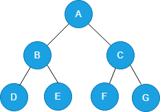
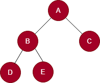
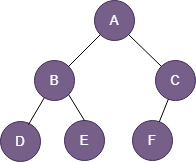
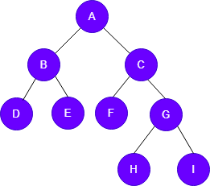
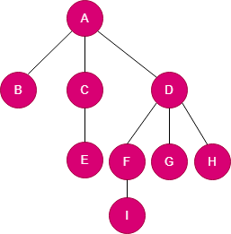

## Tree

Cover what a tree is and how they are used.

### 1. Introduction - What is a Tree?
In computer science, a tree is a hierarchical data structure that simulates a tree-like structure with a set of connected nodes. Unlike linear data structures such as arrays or linked lists, trees allow for more complex relationships and efficient organization of data. They are particularly useful for representing data that naturally forms a hierarchy, such as file systems, organizational structures, and more.

Visual Representation:
        A
       / \
      B   C
     / \   \
    D   E   F
In the above example:

A is the root node.
B and C are child nodes of A.
D and E are children of B, while F is a child of C.

### 2. Defining a Tree
A tree is made up of nodes that are arranged in a hierarchical structure. At the top of the hierarchy is the root node, which acts as the starting point. All other nodes are connected through edges. The nodes are grouped into levels, and the maximum level of any node in the tree is referred to as the depth.

Here are the key terms related to trees:

- Root Node: The node at the top of the tree. It is the node from where the whole tree originates. For any tree traversal operation, this node serves as the starting point.

- Nodes: All the elements in the tree, including the root, are nodes, and each node has a unique value and may have child nodes connected to it.

- Parent Node: A node in a tree that has one or more child nodes connected to it.

- Child Node: Nodes that are directly connected to a parent node.

- Sibling Nodes: Nodes that share the same parent node.

- Ancestor Nodes: All the nodes in the path from a specific node to the root node.

- Descendant Nodes: All the nodes reachable from a specific node down to the leaves.

- Leaf Node: Nodes in the tree that do not have any children.

- Internal Node: A node with at least one child.

- Edge: The connection between one node and another.

- Path: A sequence of nodes connected by edges.

- Height of a Node: The number of edges on the longest path from the node to a leaf. - Height goes down to leaves- full path - Depth goes up to root from a specific node

- Depth of a Node: The number of edges from the node to the tree's root node.

- Height of the Tree: The height of the root node.

- Degree of a Node: The number of children a node has.

- Subtree: A smaller tree within the main tree, consisting of a node and its descendants.

- The following figure illustrates the different components of a tree.

### 3. Tree Height and Depth
The height of a tree is the number of edges on the longest path from the root node to the leaf node. It represents the depth of the tree from the root. In contrast, the depth of a specific node in the tree is the number of edges from the root node to that particular node.

### 4. Levels in Trees
Levels in a tree are defined based on the distance from the root node. The root node is at level 0; its children are at level 1, and so on. The level of a node indicates its generation within the tree.

### 5. Types of Trees
- Binary Trees:
Binary trees are a type of tree where each node can have at most two children, commonly referred to as the left child and the right child. The structure of a binary tree makes it a fundamental and widely used data structure in computer science.

- Full Tree:
In a full tree, every node has either zero children (leaf node) or two children. There are no nodes with only one child. Full trees are also known as proper binary trees.

- Complete Tree:
A complete tree is a binary tree in which all levels are filled, except possibly the last level. The last level must strictly be filled from left to right. Data structures like Heap uses complete binary trees for efficient operations.

- Balanced Tree:
Balanced trees are binary trees where the difference in height between the left and right subtrees of any node in the tree is not more than 1. This ensures the tree remains reasonably balanced, preventing skewed structures and maintaining optimal search and insertion times.

- Multi-way Tree:
Unlike binary trees, multi-way trees allow nodes to have more than two children. Each node can have multiple branches, making multi-way trees more flexible in representing hierarchical data.

