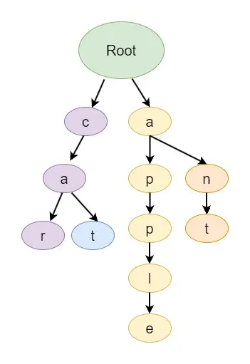
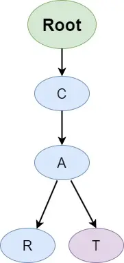
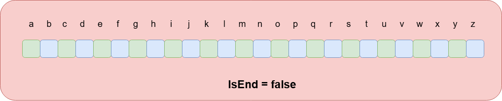

# Introduction to Trie

A Trie, short for retrieval, is a specialized tree-based data structure primarily used for efficient storing, searching, and retrieval of strings over a given alphabet. It excels in scenarios where a large collection of strings needs to be managed and pattern-matching operations need to be performed with optimal efficiency.

## Defining a Trie

A Trie, often referred to as a prefix tree, is constructed to represent a set of strings where each node in the tree corresponds to a single character of a string. The path from the root node to a particular node represents the characters of a specific string. This structural characteristic allows Tries to effectively share common prefixes among strings, leading to efficient storage and retrieval.

In the context of a Trie, the given strings are typically formed from a fixed alphabet. Each edge leading from a parent node to its child node corresponds to a character from the alphabet. By following the path of characters from the root to a specific node, we can reconstruct the string associated with that path.



In the Trie diagram, `car` and `cat` share a common prefix, and `apple` and `ant` share a common prefix.

## Why You Need a Trie Data Structure?

Tries are commonly employed in applications such as spell checking, autocomplete suggestions, and searching within dictionaries or databases. They excel at these tasks because they minimize the search complexity in proportion to the length of the target string, making them significantly more efficient than other data structures like binary search trees.

## Properties of the Trie Data Structure

Trie is a tree-like data structure. So, it's important to know the properties of Trie.

1. **Single Root Node**: Every trie has one root node, serving as the starting point for all strings stored within.
2. **Node as a String**: In a trie, each node symbolizes a string, with the path from the root to that node representing the string in its entirety.
3. **Edges as Characters**: The edges connecting nodes in a trie represent individual characters. This means that traversing an edge essentially adds a character to the string.
4. **Node Structure**: Nodes in a trie typically contain either hashmaps or arrays of pointers. Each position in this array or hashmap corresponds to a character. Additionally, nodes have a flag to signify if a string concludes at that particular node.
5. **Character Limitation**: While tries can accommodate a vast range of characters, for the purpose of this discussion, we're focusing on lowercase English alphabets (a-z). This means each node will have 26 pointers, with the 0th pointer representing 'a' and the 25th one representing 'z'.
6. **Path Equals Word**: In a trie, any path you trace from the root node to another node symbolizes a word or a string. This makes it easy to identify and retrieve strings.

These properties underline the essence of the trie data structure, emphasizing its efficiency and utility in managing strings, especially when dealing with large datasets.

## Implementation of Tries

Let's start by understanding the basic implementation of a Trie. Each node in a Trie can have multiple children, each representing a character. To illustrate this, consider the following simple Trie structure:



Here's a step-by-step guide to implement a Trie:

- The Trie starts from the root node.
- The path from the root to the node "c" represents the character "c."
- The path from "c" to "a" represents the string "ca," and from "a" to "r" represents the string "car."
- The path from "c" to "a" represents the string "ca," and from "a" to "t" represents the string "cat."

### Representation of Trie Node

The Trie node has an array or list of children nodes, typically of size 26 to represent the English lowercase alphabets (a-z). Additionally, there's a boolean flag `isEndOfWord` to indicate whether the current node marks the end of a word in the Trie.



Now, let's look at the basic operations such as `insertion`, `searching`, and `deletion` on the Trie data structure.

## Insertion in Trie Data Structure

Insertion in a Trie involves adding a string to the Trie, character by character, starting from the root. If the character already exists in the Trie, we move to the next node; otherwise, we create a new node for the character.

### Algorithm

1. Start from the root node.
2. For each character in the string:
   - Check if the character exists in the current node's children.
   - If it exists, move to the corresponding child node.
   - If it doesn't exist, create a new node for the character and link it to the current node.
   - Move to the newly created node.
3. After processing all characters in the string, mark the current node as the end of the word.

### Example

Consider that we need to insert the 'can', 'cat', 'cant', and 'apple' into the trie. We insert them in the following order:

1. **Initial Trie**:

```
Root
```

2. **Insert 'can'**:

```
Root
 |
 c
 |
 a
 |
 n
```

**Explanation**: Starting from the root, we add nodes for each character in "can".

3. **Insert 'cat'**:

```
Root
 |
 c
 |
 a
 | \
 n   t
```

**Explanation**: "cat" shares the first two characters with "can", so we just add a new branch for the 't' after 'a'.

4. **Insert 'cant'**:

```
Root
 |
 c
 |
 a
 | \
 n   t
 |
 t
```

**Explanation**: "cant" extends from the path of "can", so we add a new node for 't' after the existing 'n'.

5. **Insert 'apple'**:

```
   Root
  /   \
 c     a
 |     |
 a     p
 | \   |
 n  t  p
 |     |
 t     l
       |
       e
```

**Explanation**: Starting from the root, we add nodes for each character in "apple" branching from the 'a' node.

```go
package main

// type TrieNode struct {
// 	Children   [26]*TrieNode // Array to store Children nodes for each character
// 	IsEnd bool         // Flag to indicate if this node is the end of a word
// }

type Trie struct {
	root *TrieNode // Root of the Trie
}

// Constructor for TrieNode
func NewTrieNode() *TrieNode {
	return &TrieNode{}
}

// Constructor for Trie
func NewTrie() *Trie {
	return &Trie{root: NewTrieNode()}
}

// Function to insert a word into the Trie
func (t *Trie) Insert(word string) {
	node := t.root
	for i := 0; i < len(word); i++ {
		index := word[i] - 'a' // Convert character to index
		if node.Children[index] == nil {
			node.Children[index] = NewTrieNode() // Create a new node if it doesn't exist
		}
		node = node.Children[index]
	}
	node.IsEnd = true // Mark the end of the word
}

```

### Complexity Analysis

**Time Complexity**: O(n) - Where `n` is the length of the word. This is when the word doesn't share any prefix with the words already in the Trie or is longer than any word in the Trie.

**Space Complexity**:

- **Best Case**: O(1) - When the word is entirely a prefix of an existing word or shares a complete prefix with words in the Trie.
- **Worst Case**: O(n) - When the word doesn't share any characters with the words in the Trie.

## Searching in Trie Data Structure

Searching in a Trie is similar to the insertion into the Trie. Let's look at the algorithm to search in the Trie data structure.

### Algorithm

1. Start from the root node.
2. For each character in the word:
   - a. Calculate its index (e.g., 'a' is 0, 'b' is 1, ...).
   - b. Check if the corresponding child node exists.
   - c. If it exists, move to the child node and continue.
   - d. If it doesn't exist, return false (word not found).
3. After processing all characters, check the `isEndOfWord` flag of the current node. If it's true, the word exists in the Trie; otherwise, it doesn't.

```go
// type TrieNode struct {
// 	Children   [26]*TrieNode // Children nodes
// 	IsEnd      bool          // Flag to represent the end of a word
// }

type Trie struct {
	root *TrieNode
}

// Constructor for TrieNode
func NewTrieNode() *TrieNode {
	return &TrieNode{}
}

// Constructor for Trie
func NewTrie() *Trie {
	return &Trie{root: NewTrieNode()}
}

// Function to search a word in the Trie
func (t *Trie) Search(word string) bool {
	node := t.root
	for i := 0; i < len(word); i++ {
		index := word[i] - 'a'
		if node.Children[index] == nil {
			return false // Word not found
		}
		node = node.Children[index]
	}
	return node.IsEnd // Return true if word exists, false otherwise
}
```

### Complexity Analysis

**Time Complexity**: O(n) - Where `n` is the length of the word. This happens when you have to traverse the Trie to the deepest level.

**Space Complexity**: O(1) - Searching doesn't require any additional space as it's just about traversing the Trie.

## Deletion in Trie Data Structure

When we delete a key in a Trie, there are three cases to consider:

1. **Key is a leaf node**: If the key is a leaf node, we can simply remove it from the Trie.
2. **Key is a prefix of another key**: If the key is a prefix of another key in the Trie, then we cannot remove it entirely. Instead, we just unmark the isEndOfWord flag.
3. **Key has children**: If the key has children, we need to recursively delete the child nodes. If a child node becomes a leaf node after the deletion of the key, we can remove the child node as well.

### Step-by-Step Algorithm

1. **Initialization**:
   - Start at the **root** of the Trie.
   - Begin processing the word you want to delete, starting from its first character.
   - Keep track of the current depth in the word.

2. **Base Case**:
   - If you’ve reached the end of the word (i.e., `depth == word.length()`):
     - Check the `isEnd` flag:
       - If the flag is not set, the word is not present in the Trie. Return the current node without changes.
       - If the flag is set, unset it. This marks the word as no longer valid in the Trie.
     - Check if the node has any children:
       - If it has no children, delete the node (set it to `null`) and return `null` to its parent, indicating that it can be removed.
       - If it has children, return the node, as it is part of other words.

3. **Recursive Case**:
   - For the current character of the word:
     - Compute its corresponding index in the `children` array (e.g., `'a'` is 0, `'b'` is 1, etc.).
     - Make a recursive call to the `deleteKey` function for the child node with the next character in the word.

4. **Post-Recursive Handling**:
   - After returning from the recursive call:
     - If the child node for the current character was deleted (i.e., set to `null`), update the `children` array of the current node to remove the reference to the child.
     - Check if the current node can also be deleted:
       - If the current node has no children (`isEmpty()` returns true) and is not marked as the end of another word (`isEnd` is false), delete it (set it to `null`) and return `null` to the parent.
       - Otherwise, return the current node.

5. **Completion**:
   - Once all characters of the word are processed, the word will be deleted if it exists, and the Trie structure will be updated accordingly.
   - If the word does not exist in the Trie, no changes will be made.

```go
// type TrieNode struct {
// 	Children [26]*TrieNode // Children nodes
// 	IsEnd    bool          // Flag to represent the end of a word
// }

type Trie struct {
	root *TrieNode
}

func NewTrieNode() *TrieNode {
	return &TrieNode{}
}

func NewTrie() *Trie {
	return &Trie{root: NewTrieNode()}
}

// Function to check if a Trie node has any Children
func isEmpty(root *TrieNode) bool {
	for _, child := range root.Children {
		if child != nil {
			return false // Found a child node
		}
	}
	return true // No Children present
}

// Recursive function to delete a word from the Trie
func deleteKey(root *TrieNode, key string, depth int) *TrieNode {
	// If the Trie is empty, return nil
	if root == nil {
		return nil
	}

	// If we've reached the end of the word
	if depth == len(key) {
		// Mark the node as not being the end of a word
		if root.IsEnd {
			root.IsEnd = false
		}

		// If the node has no Children, free the memory
		if isEmpty(root) {
			return nil
		}

		return root
	}

	// Recur for the child corresponding to the current character
	index := key[depth] - 'a'
	root.Children[index] = deleteKey(root.Children[index], key, depth+1)

	// If the node has no Children and is not the end of another word, free it
	if isEmpty(root) && !root.IsEnd {
		return nil
	}

	return root
}

// Function to delete a word from the Trie
func (t *Trie) DeleteWord(word string) {
	t.root = deleteKey(t.root, word, 0)
}
```

### Complexity Analysis

**Time Complexity**: O(n) - Where `n` is the length of the word. This is when you have to traverse the Trie to the deepest level and potentially backtrack to delete nodes.

**Space Complexity**: O(n) - Where `n` is the length of the word. This is due to the recursion stack used during the deletion process.

## Advantages of Using Tries

- **Fast Pattern Matching**: Tries provide rapid pattern matching queries, taking time proportional to the length of the pattern (or the string being searched).
- **Common Prefix Sharing**: Strings with common prefixes share nodes in the Trie, leading to efficient memory utilization and reduced redundancy.
- **Efficient Insertion and Deletion**: Tries are amenable to dynamic operations like insertion and deletion, while maintaining efficient search times.
- **Alphabet Flexibility**: Tries can handle various alphabets, making them versatile for a range of applications.
- **Word Frequency Counting**: Tries can be extended to store additional information at nodes, such as the frequency of words or strings.

In comparison to using a binary search tree, where a well-balanced tree would require time proportional to the product of the maximum string length and the logarithm of the number of keys, Tries offer the advantage of a search time linearly dependent on the length of the string being searched. This results in an optimization of search operations, especially when dealing with large datasets.

In summary, a Trie is a powerful data structure that optimizes string-related operations by efficiently storing and retrieving strings with shared prefixes. Its unique structure and fast search capabilities make it an invaluable tool in various text-based applications.